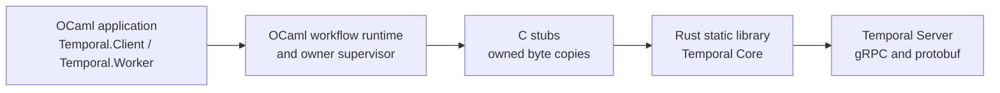

# OCaml Temporal SDK

[](https://github.com/mfow/ocaml-temporal/actions/workflows/build.yml)

> **Community-maintained and unofficial. Not affiliated with or endorsed by Temporal Technologies, Inc.**

OCaml Temporal SDK is an experimental, pre-`0.1.0` implementation of a
Temporal SDK for OCaml 5. It is intended to let an OCaml application own a
worker that runs deterministic workflow code as well as activities. It is not
only a client for starting a workflow and reading its result.

The API and the native boundary may change while the worker implementation is
completed. The repository is useful today for experimenting with workflow
authoring, deterministic scheduling, typed payloads, the OCaml/Rust bridge,
and the first native worker command slice. It is not yet a drop-in replacement
for the mature Temporal SDKs.

## Architecture in one picture

The final application artifact is an OCaml executable. Rust is a private
static-library implementation detail of that executable; it is not a sidecar
process and it does not own the OCaml application.



One supervisor owns the Rust runtime, Temporal client, optional worker, and
their native lifetimes for one SDK instance. Public OCaml values do not expose
Rust handles, pointers, Tokio futures, or protobuf types.

OCaml and Rust exchange a small, private, strictly validated JSON protocol.
Both sides validate the complete document, copy bytes at the ownership
boundary, and return bounded typed errors. This JSON is an internal ABI choice:
it is not JSON sent to Temporal Server. Rust alone converts between the private
semantic records and Temporal Core's protobuf/gRPC messages. A workflow payload
may itself use the standard `json/plain` encoding, but Temporal payloads are
opaque bytes and applications may choose another deterministic codec.

## What works now

| Area | Current status |
| --- | --- |
| Workflow authoring | Ordinary OCaml functions, typed `result` errors, codecs, timers, activities, futures, and deterministic replay-oriented scheduling are implemented and covered by unit tests. |
| Synthetic execution | The in-memory runtime exercises activity and child-workflow scheduling, timer resolution, cancellation, replay, future aggregation, and cache cleanup without a server. |
| Native worker | An HTTP(S) worker can be built with the OCaml-owned supervisor. The current native command slice polls and completes workflow/activity tasks, runs OCaml implementations, handles timers and terminal/cancellation paths, drains retryable completions safely, records activity heartbeats, and supports retained asynchronous activity completion. The complete [PR #289 CI run](https://github.com/mfow/ocaml-temporal/actions/runs/29333761719) live-verifies the seventeen-result Compose acceptance, including Temporal-driven heartbeat-timeout retry, activity-level non-retryable error-type matching, child-workflow retry, and duplicate-ID child-start failure; [PR #253](https://github.com/mfow/ocaml-temporal/actions/runs/29286560471) remains evidence for the separate two-generation restart/replay acceptance. |
| Native client | The HTTP(S) client path is wired to the Rust/Core client for typed workflow starts, exact workflow/run waits, exact-run cancellation, and typed exact-run signals. Cancellation is acknowledged by the server before the caller waits on the same handle for the eventual typed cancelled terminal result; signal acknowledgement likewise does not claim that a worker handler has already run. The [PR #289 CI run](https://github.com/mfow/ocaml-temporal/actions/runs/29333761719) live-verifies the current seventeen workflow assertions, including typed signal delivery and condition wake-up; earlier runs remain linked below as historical evidence for smaller slices. |
| Local development | Docker Compose supplies the OCaml development image and a separate real Temporal Server backed by PostgreSQL. Make targets are the supported interface. |
| Safety boundary | Rust/Core protobuf handling stays in Rust. OCaml/Rust JSON validation, copied payloads, one-owner lifecycle serialization, and idempotent cleanup are covered by focused tests. |

## What is deliberately still pending

- The two-public-OCaml-binary gate now has seventeen exact terminal assertions:
  fifteen workflows start before the first wait, including the parent that
  proves duplicate-ID child-start failure; the driver then stages the
  start-to-close and heartbeat-timeout retry scenarios after the shorter
  heartbeat path. It waits for the signal workflow's worker-visible readiness
  marker before signaling it, observes delayed asynchronous completion, follows
  a continue-as-new successor, checks the activity-level non-retryable policy
  result, and requires a child workflow to reach its second server-owned retry
  attempt. The complete [PR #289 CI
  run](https://github.com/mfow/ocaml-temporal/actions/runs/29333761719) verifies this
  expanded acceptance against Temporal Server and PostgreSQL; the [PR #277
  run](https://github.com/mfow/ocaml-temporal/actions/runs/29318684069) remains
  evidence for the prior fifteen-result slice, and [PR #266](https://github.com/mfow/ocaml-temporal/actions/runs/29311239247)
  remains the focused evidence for the earlier thirteen-result signal path.
  Sticky-cache eviction, crash recovery, and broader child lifecycle scenarios
  remain separate acceptance work.
- Child-workflow commands can be authored and are translated by the semantic
  layer. The native worker now accepts a parent completion containing a child
  start, retains the parent future through the start acknowledgment, and
  resumes it from a later terminal child-resolution activation. Focused Rust,
  OCaml, and fixture tests cover this protocol and lifecycle; the two-binary
  Compose acceptance now proves successful, failed, and cancelled parent/child
  paths against Temporal Server, including a child that retries to a second
  server-owned attempt and a duplicate-ID child-start failure. Child replay and
  recovery remain follow-up scenarios.
- Typed signal, query, and update definitions plus deterministic local handler
  dispatch are available as an experimental OCaml-only slice. Native Temporal
  interaction delivery, conditions, handler policies, versioning, local
  activities, Nexus, and the remaining cross-SDK parity surface are roadmap
  work. Continue-as-new is implemented and locally tested at the
  workflow/native bridge boundary and is verified by the [PR #253 Compose
  run](https://github.com/mfow/ocaml-temporal/actions/runs/29286560471).
  Context-aware activity heartbeats are live-verified for a server-delivered
  heartbeat detail and retry; timeout-triggered retry and delayed asynchronous
  completion are also covered. The complete [PR #277 CI
  run](https://github.com/mfow/ocaml-temporal/actions/runs/29318684069) additionally
  verifies heartbeat-timeout retry and activity-level non-retryable error-type
  matching. Native interaction delivery beyond the current signal/query slice,
  replay, and recovery remain separate work.
- The public API, native protocol, and Temporal Core pin remain experimental
  and may change before a stable release.

Read [the workflow guide](docs/guides/workflows.md) for the supported authoring
model and [the documentation guide](docs/README.md) for the status of each
layer.

## Quick start

Requirements: Docker with Compose v2 and GNU Make. The normal build and test
path does not require OCaml, Dune, Rust, or Python installed on the host.

```sh
make build                    # build OCaml and the pinned Rust bridge
make test-unit                # codecs, definitions, client/worker API tests
make test-runtime             # deterministic runtime and native adapter tests
make verify                   # version check, lint, all Dune/Rust/bridge tests
make quality                  # pinned Rust quality and spelling tools
make license-check            # permissive dependency audit
make test-temporal-integration # real PostgreSQL + Temporal + two OCaml binaries
```

The default development image uses OCaml 5.2. To try another supported image,
pass `OCAML_VERSION`, for example `make verify OCAML_VERSION=5.5`. CI has a
fast representative pull-request gate and an exhaustive compatibility gate. A
code PR verifies Linux amd64 with OCaml 5.2 and 5.5, Linux arm64 with OCaml
5.5, macOS ARM64 with OCaml 5.5, the pinned quality and dependency-license
checks, and the OCaml 5.5 Temporal/PostgreSQL smoke. The Windows x64 OCaml 5.5
native job is added to a PR when changes affect the native bridge,
build/toolchain, workflow, or composite-action configuration. JSON protocol
schemas under `docs/schemas/` are treated as code for this policy. Pushes to `master` and
scheduled runs retain the exhaustive Linux matrix (OCaml 5.2–5.5 on amd64 and
arm64) plus both OCaml 5.5 native desktop jobs. The standalone license audit is
run once per workflow, not once per
matrix cell. These entries describe configured jobs, not evidence that a
particular Actions run has completed; runs may remain queued while the
repository quota is exhausted. The workflow cancels superseded runs for the
same pull request (or the master push ref), while each job timeout starts only
after GitHub allocates a runner; GitHub does not provide a native timeout for a
job that is still waiting in the quota queue.

When Actions is queued, use `make check OCAML_VERSION=5.2` as the representative
Docker-backed local baseline. It combines `make verify` with the package/OCaml
license audit. Run `make quality` separately when the pinned native
`cargo-deny`, `cargo-machete`, and `typos` binaries are installed; CI installs
the checksum-verified versions. On Windows or macOS, `make native-verify`
exercises the corresponding OCaml 5.5/Rust native compatibility path. The
locked Cargo license scanner runs once in its isolated CI job and is not
claimed by `make license-check`; `make test-temporal-integration` is the
optional, expensive live Temporal Server/PostgreSQL check. Local results are
interim evidence only and do not turn an unexecuted matrix, platform, or live
server job green.

On a memory-constrained Docker VM, bound Dune's native build concurrency with
`make build DUNE_JOBS=1`; leaving `DUNE_JOBS` unset preserves the default
parallelism used by CI.

### The real Temporal smoke

`make test-temporal-integration` starts the pinned Temporal Server and
PostgreSQL containers under `test/integration/temporal/` from a fresh Compose
project. It waits for both SQL schemas and the Temporal frontend to be healthy,
runs the OCaml supervisor lifecycle acceptance executable, starts a public
OCaml worker, and runs a separate public OCaml driver. The worker is the
long-lived process that registers and executes the workflows and mock activity.
The driver is a one-shot OCaml test runner: it does not register a worker. Its
current implementation starts fifteen smoke workflows before waiting,
including delayed asynchronous activity completion, activity-level
non-retryable policy matching, signal/condition handling, continue-as-new, and
the duplicate-ID child-start-failure parent. It then starts the start-to-close
timeout-retry workflow after heartbeat completion and the heartbeat-timeout-
retry workflow after that result. It waits for the signal workflow's exact
readiness marker before signaling it, sends an exact-run cancellation request
for the long-running workflow, waits for all seventeen exact terminal results,
and exits nonzero if any expected result is not returned. The complete [PR #289
CI run](https://github.com/mfow/ocaml-temporal/actions/runs/29333761719) passed
this expanded acceptance against Temporal Server 1.31 and PostgreSQL,
including the child-retry and child-start-failure markers. The [PR #277 CI
run](https://github.com/mfow/ocaml-temporal/actions/runs/29318684069) remains
evidence for the prior fifteen-result slice, the [PR #266 CI
run](https://github.com/mfow/ocaml-temporal/actions/runs/29311239247) remains
focused evidence for the signal path, and the earlier [PR #253 CI
run](https://github.com/mfow/ocaml-temporal/actions/runs/29286560471) remains evidence
for the prior twelve-result path. The earlier [PR #210 CI
run](https://github.com/mfow/ocaml-temporal/actions/runs/29221151859)
live-verified the original nine assertions: four exact successes, ordinary
activity retry, heartbeat-detail retry, parent/child success, propagated child
failure, child cancellation, a typed non-retryable workflow failure, and
marker-guarded exact-run cancellation. That PR was squash-merged as `f877fbf`.
The Makefile stops the worker and checks its graceful-shutdown marker when the
target runs.
The target removes the PostgreSQL data volume before and after the run, so no
database state is preserved between acceptance runs. A separate
`make test-temporal-worker-restart` target covers live worker replacement and
replay. Child replay and recovery, sticky-cache eviction, crash recovery, and
broader recovery coverage remain follow-up work; child retry and duplicate-ID
child-start failure are live-verified by PR #289 above.

For manual inspection, use `make temporal-start`, `make temporal-health`,
`make temporal-status`, `make temporal-logs`, and `make temporal-clean`.
Running Compose directly from the repository root is unsupported; the Makefile
selects the fixture and its project directory for you. See the [local stack
reference](docs/reference/local-temporal-stack.md) for the exact acceptance
boundary and cleanup behavior.

## A small workflow example

Workflow code is direct-style OCaml. This example turns one name into a short
two-line message: it asks a separate activity worker to render a greeting and
a next step, records a durable pause, and returns their results together. A
future represents a result that may arrive in a later Temporal activation;
`Future.await` suspends only the current workflow fiber. Expected operational
failures are values, so helpers compose with `result` rather than using
exceptions for control flow.

```ocaml
let render_message =
  Temporal.Activity.remote
    ~name:"ocaml-temporal-example.render-message"
    ~input:Temporal.Codec.string
    ~output:Temporal.Codec.string

let compose_message name =
  let open Temporal.Result_syntax in
  let name = String.trim name in
  if String.equal name "" then
    Error (Temporal.Error.defect ~message:"a name is required")
  else
    let greeting =
      Temporal.Activity.start render_message ("greeting:" ^ name)
    in
    let next_step =
      Temporal.Activity.start render_message ("next-step:" ^ name)
    in
    let pause =
      Temporal.Workflow.start_sleep (Temporal.Duration.of_ms 250L)
    in
    let* messages, () =
      Temporal.Future.await
        (Temporal.Future.both (Temporal.Future.all [ greeting; next_step ])
           pause)
    in
    Ok (String.concat "\n" messages)

let compose_message_workflow =
  Temporal.Workflow.define
    ~name:"ocaml-temporal-example.compose-message"
    ~input:Temporal.Codec.string
    ~output:Temporal.Codec.string
    compose_message
```

Both activities and the timer are started before anything is awaited, so
Temporal can make independent progress while replay always sees the same command
order. `compose_message` and its ordinary helpers are just OCaml functions;
only explicit SDK operations such as activity scheduling or a durable timer
create Temporal history commands. This example is covered by the deterministic
runtime and the current native activity/timer command slice; it is not a claim
that every future Temporal feature is complete.

The complete, buildable version is split the way a real deployment often is:

- [Workflow worker](examples/workflow_worker/workflow_worker.ml) registers the
  deterministic workflow and shuts down gracefully on `SIGINT` or `SIGTERM`.
- [Activity worker](examples/activity_worker/activity_worker.ml) registers the
  activity implementation, the appropriate boundary for external work.
- [Client](examples/client/client.ml) connects, starts one exact workflow run,
  waits for its typed terminal result, prints it, and releases the connection.

See the [examples guide](examples/README.md) for the startup order, connection
settings, and commands. CI compiles all three executables on every Docker and
native build without running them.

See [Writing Workflows in OCaml](docs/guides/workflows.md) for codecs, worker
registration, client handles, child-workflow boundaries, futures, and
determinism rules.

## Logging

The SDK reports application-configurable events through the OCaml `logs`
library. Stable sources include `temporal.sdk.lifecycle`,
`temporal.sdk.bridge`, and `temporal.sdk.workflow`, with structural operation,
error-kind, and elapsed-time tags. The library does not install a reporter or
choose a global log level. Payload bytes, workflow arguments, and bridge JSON
are excluded from log messages. See the [observability reference](docs/reference/observability.md).

## Further documentation

- [Documentation guide and glossary](docs/README.md)
- [Workflow authoring guide](docs/guides/workflows.md)
- [Architecture specification](docs/superpowers/specs/2026-07-11-ocaml-temporal-sdk-design.md)
- [Implementation roadmap](docs/implementation-roadmap.md)
- [Runtime invariants](docs/reference/runtime-invariants.md)
- [Native Core bridge and ownership](docs/reference/core-bridge.md)
- [Private JSON control protocol](docs/reference/core-protocol.md)
- [Native client JSON protocol](docs/reference/client-protocol.md)
- [Native workflow execution](docs/reference/native-worker-execution.md)
- [Native activity protocol and execution](docs/reference/activity-protocol.md)
  and [activity execution lifecycle](docs/reference/native-activity-execution.md)
- [Deterministic workflow time](docs/reference/workflow-time.md)
- [Interactive workflows](docs/reference/interactive-workflows.md) and the
  [native interaction design](docs/design/native-interactions.md)
- [Logging and observability](docs/reference/observability.md)
- [Feature coverage and implementation status](docs/reference/feature-coverage.md)
- [Live acceptance coverage](docs/reference/live-acceptance-coverage.md)
- [Worker restart and replay acceptance](docs/reference/worker-restart-replay-acceptance.md)
- [Worker restart/replay diagnostic contract](docs/reference/worker-restart-replay-diagnostics.md)
- [Replay bridge](docs/reference/replay-bridge.md)
- [Installed package boundary](docs/reference/package-boundary.md)
- [Local Temporal and PostgreSQL stack](docs/reference/local-temporal-stack.md)
- [Quality and security gates](docs/reference/quality-gates.md)
- [Dependency and license inventory](docs/dependencies.md)
- [Verified progress](docs/progress.md)

## License

Project source is licensed under [Apache-2.0](LICENSE). Dependencies must pass
the repository's permissive-license policy; ordinary GPL, AGPL, LGPL, and
other copyleft or source-available dependencies are prohibited. The only
standing exception is the narrowly reviewed OCaml linking exception documented
in the dependency inventory.

## AI disclosure

AI coding tools were used to generate substantial portions of this project.
All committed code in published releases has been reviewed by the maintainer,
who accepts responsibility for its correctness, security, licensing, and
ongoing maintenance. No unreviewed model output is released.

AI models used to help build this project:

### OpenAI
- GPT-5
- GPT 5.6 Sol
- GPT 5.6 Terra
- GPT 5.6 Luna

### xAI
- Grok 4.5

### Anthropic
- Fable 5
- Opus 4.8
- Sonnet 5
