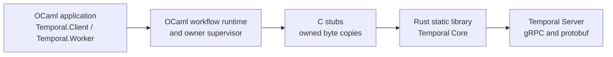

# OCaml Temporal SDK

[](https://github.com/mfow/ocaml-temporal/actions/workflows/build.yml)

> **Community-maintained and unofficial. Not affiliated with or endorsed by Temporal Technologies, Inc.**

OCaml Temporal SDK is an experimental, pre-`0.1.0` implementation of a
Temporal SDK for OCaml 5. It is intended to let an OCaml application own a
worker that runs deterministic workflow code as well as activities. It is not
only a client for starting a workflow and reading its result.

The API and the native boundary may change while the worker implementation is
completed. The repository is useful today for experimenting with workflow
authoring, deterministic scheduling, typed payloads, the OCaml/Rust bridge,
and the first native worker command slice. It is not yet a drop-in replacement
for the mature Temporal SDKs.

## Architecture in one picture

The final application artifact is an OCaml executable. Rust is a private
static-library implementation detail of that executable; it is not a sidecar
process and it does not own the OCaml application.



One supervisor owns the Rust runtime, Temporal client, optional worker, and
their native lifetimes for one SDK instance. Public OCaml values do not expose
Rust handles, pointers, Tokio futures, or protobuf types.

OCaml and Rust exchange a small, private, strictly validated JSON protocol.
Both sides validate the complete document, copy bytes at the ownership
boundary, and return bounded typed errors. This JSON is an internal ABI choice:
it is not JSON sent to Temporal Server. Rust alone converts between the private
semantic records and Temporal Core's protobuf/gRPC messages. A workflow payload
may itself use the standard `json/plain` encoding, but Temporal payloads are
opaque bytes and applications may choose another deterministic codec.

## What works now

| Area | Current status |
| --- | --- |
| Workflow authoring | Ordinary OCaml functions, typed `result` errors, codecs, timers, activities, futures, and deterministic replay-oriented scheduling are implemented and covered by unit tests. |
| Synthetic execution | The in-memory runtime exercises activity and child-workflow scheduling, timer resolution, cancellation, replay, future aggregation, and cache cleanup without a server. |
| Native worker | An HTTP(S) worker can be built with the OCaml-owned supervisor. The current native command slice polls and completes workflow/activity tasks, runs OCaml implementations, handles timers and terminal/cancellation paths, and drains retryable completions safely. Focused tests cover this path; the live Compose evidence is limited to the baseline success/failure scenarios described below. Context-aware activity heartbeats are implemented and focused-tested through the same serialized supervisor path, but have not yet been verified against a live Temporal Server. |
| Native client | The HTTP(S) client path is wired to the Rust/Core client for typed workflow starts, exact workflow/run waits, and exact-run cancellation. Cancellation is acknowledged by the server before the caller waits on the same handle for the eventual typed cancelled terminal result. The historical live Compose evidence covers five baseline executions: four exact successes and one deliberate non-retryable workflow failure. The nine-run cancellation, heartbeat, and child-lifecycle assertions are implemented and locally covered, but are not live-verified because the expanded Actions run was cancelled and later checks may remain queued under the repository quota. |
| Local development | Docker Compose supplies the OCaml development image and a separate real Temporal Server backed by PostgreSQL. Make targets are the supported interface. |
| Safety boundary | Rust/Core protobuf handling stays in Rust. OCaml/Rust JSON validation, copied payloads, one-owner lifecycle serialization, and idempotent cleanup are covered by focused tests. |

## What is deliberately still pending

- The two-public-OCaml-binary gate has historical live evidence for the initial
  success paths, server-managed activity retry, parent/child completion, and
  one typed non-retryable workflow failure. The current driver implementation
  starts nine workflows through one OCaml driver, and a separate long-lived
  OCaml worker returns their exact results or typed terminal outcomes. Its
  marker-guarded exact-run cancellation, heartbeat-detail retry, and
  child-lifecycle assertions
  are implemented and locally covered, but are not live-verified: the
  attempted Actions run was cancelled before producing a green result.
  Restart, replay, and cache-eviction scenarios remain separate acceptance
  work.
- Child-workflow commands can be authored and are translated by the semantic
  layer. The native worker now accepts a parent completion containing a child
  start, retains the parent future through the start acknowledgment, and
  resumes it from a later terminal child-resolution activation. Focused Rust,
  OCaml, and fixture tests cover this protocol and lifecycle; the two-binary
  Compose acceptance now proves one successful parent/child path against
  Temporal Server. Child failure, cancellation, and recovery remain follow-up
  scenarios.
- Typed signal, query, and update definitions plus deterministic local handler
  dispatch are available as an experimental OCaml-only slice. Native Temporal
  interaction delivery, conditions, handler policies, versioning, local
  activities, Nexus, and the remaining cross-SDK parity surface are roadmap
  work. Continue-as-new is implemented and locally tested at the
  workflow/native bridge boundary, but still needs live Temporal Server
  acceptance. Context-aware activity heartbeats have the same
  implemented-but-not-live status.
- The public API, native protocol, and Temporal Core pin remain experimental
  and may change before a stable release.

Read [the workflow guide](docs/guides/workflows.md) for the supported authoring
model and [the documentation guide](docs/README.md) for the status of each
layer.

## Quick start

Requirements: Docker with Compose v2 and GNU Make. The normal build and test
path does not require OCaml, Dune, Rust, or Python installed on the host.

```sh
make build                    # build OCaml and the pinned Rust bridge
make test-unit                # codecs, definitions, client/worker API tests
make test-runtime             # deterministic runtime and native adapter tests
make verify                   # version check, lint, all Dune/Rust/bridge tests
make quality                  # pinned Rust quality and spelling tools
make license-check            # permissive dependency audit
make test-temporal-integration # real PostgreSQL + Temporal + two OCaml binaries
```

The default development image uses OCaml 5.2. To try another supported image,
pass `OCAML_VERSION`, for example `make verify OCAML_VERSION=5.5`. CI runs the
verification matrix for OCaml 5.2, 5.3, 5.4, and 5.5 on Linux amd64 and arm64,
and builds the OCaml-to-Rust link natively on Windows x64 and macOS ARM64 with
OCaml 5.5. The standalone license audit is run once per CI change, not once
per matrix cell. These entries describe configured jobs, not evidence that a
particular Actions run has completed; runs may remain queued while the
repository quota is exhausted. The workflow cancels superseded runs for the
same pull request (or the master push ref), while each job timeout starts only
after GitHub allocates a runner; GitHub does not provide a native timeout for a
job that is still waiting in the quota queue.

When Actions is queued, use `make check OCAML_VERSION=5.2` as the representative
Docker-backed local baseline. It combines `make verify` with the package/OCaml
license audit. Run `make quality` separately when the pinned native
`cargo-deny`, `cargo-machete`, and `typos` binaries are installed; CI installs
the checksum-verified versions. On Windows or macOS, `make native-verify`
exercises the corresponding OCaml 5.5/Rust native compatibility path. The
locked Cargo license scanner runs once in its isolated CI job and is not
claimed by `make license-check`; `make test-temporal-integration` is the
optional, expensive live Temporal Server/PostgreSQL check. Local results are
interim evidence only and do not turn an unexecuted matrix, platform, or live
server job green.

On a memory-constrained Docker VM, bound Dune's native build concurrency with
`make build DUNE_JOBS=1`; leaving `DUNE_JOBS` unset preserves the default
parallelism used by CI.

### The real Temporal smoke

`make test-temporal-integration` starts the pinned Temporal Server and
PostgreSQL containers under `test/integration/temporal/` from a fresh Compose
project. It waits for both SQL schemas and the Temporal frontend to be healthy,
runs the OCaml supervisor lifecycle acceptance executable, starts a public
OCaml worker, and runs a separate public OCaml driver. The worker is the
long-lived process that registers and executes the workflows and mock activity.
The driver is a one-shot OCaml test runner: it does not register a worker. Its
current implementation starts nine smoke workflows, sends an exact-run
cancellation request for the long-running one, waits for every exact terminal
result, and exits nonzero if any expected result is not returned. The historical
live evidence covers the five baseline assertions: four workflows complete with
exact payloads (including the parent awaiting a timer-owning child), and one
returns a typed non-retryable workflow failure. The heartbeat-detail retry,
marker-guarded cancellation, and child failure/cancellation assertions are
implemented and locally covered, but are not live-verified because the
expanded Actions run was cancelled and later checks may remain queued under
the repository quota. The Makefile
stops the worker and checks its graceful-shutdown marker when the target runs.
The target removes the PostgreSQL data volume before and after the run, so no
database state is preserved between acceptance runs. Child
start-failure/cancellation, restart, replay, and recovery coverage remain
follow-up work.

For manual inspection, use `make temporal-start`, `make temporal-health`,
`make temporal-status`, `make temporal-logs`, and `make temporal-clean`.
Running Compose directly from the repository root is unsupported; the Makefile
selects the fixture and its project directory for you. See the [local stack
reference](docs/reference/local-temporal-stack.md) for the exact acceptance
boundary and cleanup behavior.

## A small workflow example

Workflow code is direct-style OCaml. A future represents a result that may
arrive in a later Temporal activation; `Future.await` suspends only the current
workflow fiber. Expected operational failures are values, so helpers compose
with `result` rather than using exceptions for control flow.

```ocaml
let summarize =
  Temporal.Activity.remote
    ~name:"summarize"
    ~input:Temporal.Codec.string
    ~output:Temporal.Codec.string

let summarize_document document =
  let open Temporal.Result_syntax in
  let summary = Temporal.Activity.start summarize document in
  let timer = Temporal.Workflow.start_sleep (Temporal.Duration.of_ms 10L) in
  let* summary, () =
    Temporal.Future.await (Temporal.Future.both summary timer)
  in
  Ok summary

let summarize_workflow =
  Temporal.Workflow.define
    ~name:"summarize_document"
    ~input:Temporal.Codec.string
    ~output:Temporal.Codec.string
    summarize_document
```

The activity is started before the timer is awaited, so independent work can
be in flight together. `summarize_document` and ordinary helpers it calls are
just OCaml functions. Only explicit SDK operations such as activity scheduling
or a durable timer create Temporal history commands. This example is covered
by the deterministic runtime and the current native activity/timer command
slice; it is not a claim that every future Temporal feature is complete.

See [Writing Workflows in OCaml](docs/guides/workflows.md) for codecs, worker
registration, client handles, child-workflow boundaries, futures, and
determinism rules.

## Logging

The SDK reports application-configurable events through the OCaml `logs`
library. Stable sources include `temporal.sdk.lifecycle`,
`temporal.sdk.bridge`, and `temporal.sdk.workflow`, with structural operation,
error-kind, and elapsed-time tags. The library does not install a reporter or
choose a global log level. Payload bytes, workflow arguments, and bridge JSON
are excluded from log messages. See the [observability reference](docs/reference/observability.md).

## Further documentation

- [Documentation guide and glossary](docs/README.md)
- [Workflow authoring guide](docs/guides/workflows.md)
- [Architecture specification](docs/superpowers/specs/2026-07-11-ocaml-temporal-sdk-design.md)
- [Implementation roadmap](docs/implementation-roadmap.md)
- [Runtime invariants](docs/reference/runtime-invariants.md)
- [Native Core bridge and ownership](docs/reference/core-bridge.md)
- [Private JSON control protocol](docs/reference/core-protocol.md)
- [Native client JSON protocol](docs/reference/client-protocol.md)
- [Feature coverage and implementation status](docs/reference/feature-coverage.md)
- [Local Temporal and PostgreSQL stack](docs/reference/local-temporal-stack.md)
- [Quality and security gates](docs/reference/quality-gates.md)
- [Dependency and license inventory](docs/dependencies.md)
- [Verified progress](docs/progress.md)

## License

Project source is licensed under [Apache-2.0](LICENSE). Dependencies must pass
the repository's permissive-license policy; ordinary GPL, AGPL, LGPL, and
other copyleft or source-available dependencies are prohibited. The only
standing exception is the narrowly reviewed OCaml linking exception documented
in the dependency inventory.

## AI disclosure

AI coding tools were used to generate substantial portions of this project.
All committed code in published releases has been reviewed by the maintainer,
who accepts responsibility for its correctness, security, licensing, and
ongoing maintenance. No unreviewed model output is released.

AI models used to help build this project:

- GPT-5.6 Sol
- GPT-5.6 Terra
- GPT-5.6 Luna
- Grok 4.5
- Fable 5
- Opus 4.8
