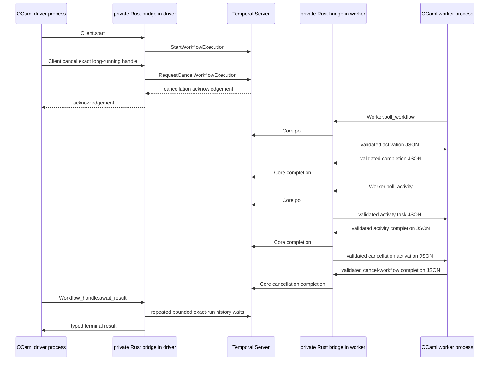

# Two-OCaml-binary Temporal acceptance design

**Status:** The [PR #289 Actions run](https://github.com/mfow/ocaml-temporal/actions/runs/29333761719)
verified the current seventeen-result baseline, including typed signal delivery,
activity retry classification, heartbeat-timeout retry, child-workflow retry,
and duplicate-ID child-start failure against real Temporal Server and PostgreSQL.
The complete
[PR #253 Actions run](https://github.com/ocaml-temporal/actions/runs/29286560471) verified the separate two-generation worker restart/replay acceptance against real Temporal Server and PostgreSQL.
The PR #253 run passed the supported Linux and native platform matrix. The
earlier [PR #229 Actions run](https://github.com/mfow/ocaml-temporal/actions/runs/29235144016)
verified all ten scenarios against real Temporal Server and PostgreSQL for
PR head `c244733`, including the timeout-ordering guard; PR #229 was then
squash-merged as `bfbd568`. The earlier [PR #226 Actions run](https://github.com/mfow/ocaml-temporal/actions/runs/29224854182)
verified the same ten scenarios with the shorter timeout-fixture delay, and
the [PR #210 Actions run](https://github.com/mfow/ocaml-temporal/actions/runs/29221151859)
verified the previous nine scenarios; that PR used head `47c9a93` and was
squash-merged as `f877fbf`. The tenth `smoke.activity_timeout_retry` scenario
has a first activity callback that sleeps beyond its 500 ms start-to-close
timeout. The current fixture keeps that late callback, and uses a dedicated
delayed two-attempt retry policy so the second attempt is not queued behind
the serialized activity adapter. The earlier run covers fan-out, timer/activity,
ordinary activity retry, heartbeat-detail retry, parent/child success,
propagated child failure, child cancellation, a typed non-retryable workflow
failure, and marker-guarded exact-run cancellation. The retry workflow still
uses an explicit two-attempt policy, while the heartbeat workflow proves that
Temporal returns the first attempt's detail and timeout to the second attempt.
The worker and driver remain guarded by
`TEMPORAL_TWO_BINARY_LIVE=1`; only the dedicated Compose services set it.

The accepted CI run adds delayed asynchronous activity completion,
continue-as-new successor following, typed signal/condition acceptance, and a
live child-start rejection to the timeout path, for seventeen top-level
assertions in the accepted baseline. The current fixture adds a long-backoff
retry assertion, bringing the pending gate to eighteen.

The current implementation starts sixteen top-level workflows before waiting
for any terminal result, including the delayed asynchronous completion,
continue-as-new successor, signal/condition, long-backoff retry, and
child-start-failure workflows.
The child-start-failure parent is started after
`two-binary-long-running-cancellation` has been accepted, then deliberately
uses that top-level workflow ID for its child; Temporal must reject the child
start with a typed non-retryable `Child_workflow` error. The driver waits for
the signal workflow's worker-visible readiness marker before signaling its exact
run. After the heartbeat-retry workflow reaches
its terminal result, it starts the start-to-close timeout workflow, then starts
the heartbeat-timeout workflow after that result. The eighteen-result assertion
also includes the activity-level non-retryable policy and a parent whose child
returns `SMOKE:CHILD_RETRY:ATTEMPT:2` on its second server-owned attempt.
This ordering keeps the six-second callback from occupying the serialized
activity adapter while the heartbeat lease is still being exercised. The
assertion target requires the exact success payloads, one propagated child
failure, one child-cancellation marker, one typed non-retryable failure, one
delayed asynchronous result, one continue-as-new successor result, one timeout
retry result, and one exact-run cancellation. The separate restart/replay
acceptance now passes in [PR #253](https://github.com/mfow/ocaml-temporal/actions/runs/29286560471);
the child-start-failure parent returns `SMOKE:CHILD:START_FAILED`; cache
eviction and broader recovery remain separate work.

The heartbeat assertion has a Docker-free contract in addition to the live
driver and worker. `test/smoke/test_temporal_heartbeat_contract.sh` checks the
source-level role boundary, registration, start-before-wait ordering, exact
retry result, and marker cleanup. The Docker-free
`test/smoke/test_temporal_activity_timeout_contract.sh` separately checks the
timeout-only activity's late first callback, short start-to-close lease,
worker registration, and exact second-attempt marker. The Dune test in
`test/integration/temporal/common/marker_test/test_smoke_definitions.ml` then
invokes the same context-aware activity callback with an in-memory context: it
checks the first typed heartbeat and retryable failure, copies the heartbeat
detail into a second attempt with the 500 ms timeout, requires the exact
success value, and proves that the completed first context rejects a later
heartbeat. These local checks are deliberately not described as Temporal
Server evidence; they make a missing registration, changed payload, lost
timeout, or context-lifetime regression fail before an expensive Compose run.

`temporal-start-worker` force-recreates the worker container before waiting, so
the readiness marker in the container's `/tmp` cannot be inherited from a
stopped container. `smoke-worker` then removes any prior readiness marker after
validating its readiness path and before later marker validation or public
`Temporal.Worker.create` begins. Once creation succeeds it publishes a new
atomic readiness marker. Compose waits for that health check before
`smoke-driver` is run. Each acceptance run starts after
`temporal-clean` has
removed the Compose project and its PostgreSQL data volume, and cleanup removes
that volume again on success or failure; no database state is preserved for a
later acceptance run. The driver starts sixteen top-level workflows before its
first terminal wait, including the delayed asynchronous-completion,
long-backoff retry, and continue-as-new scenarios. It starts the child-start-failure parent immediately
after the long-running cancellation workflow so the duplicate workflow ID is
already accepted when the child command is issued. Once the heartbeat-retry
workflow has completed, it starts the timeout-retry workflow, then the
heartbeat-timeout retry workflow, and waits for those separate results, for
eighteen top-level starts and waits. The cancellation scenario waits for the
`smoke.cancellation_ready` activity marker after the long-running workflow has
issued its durable-timer and marker commands in one activation, then
acknowledges cancellation for `two-binary-long-running-cancellation` before
the first terminal wait. Seven must complete with exact payloads, one must
propagate a typed child failure, one must return `SMOKE:CHILD:CANCELLED` after
child cancellation, one must return a typed non-retryable workflow failure,
and the cancelled execution
must return typed `Cancelled` metadata when the driver waits on that same exact
handle. The delayed asynchronous activity returns `Will_complete_async`, keeps
its task-token handle in the worker's private lease registry, and completes it
from a short-lived OCaml Domain; the driver requires the exact
`SMOKE:ASYNC:COMPLETED:SMOKE` result. The heartbeat scenario records a progress
detail with a 500 ms timeout,
returns a retryable activity error, and requires the second attempt to receive
that detail and timeout through its activity context. This prevents a TCP
check or a process that merely started from being reported as an SDK
acceptance pass.

The public `Temporal.Client` and `Temporal.Worker` now route HTTP(S) calls
through the private Rust/Core supervisor. The deterministic `mock://` backend
remains available for unit tests. The worker's native poll, bounded readiness,
completion, and typed registration loop is covered by focused tests; the
Compose acceptance supplies the first real-server verification layer.

During teardown, the worker's small test-process control Domain translates
Compose's SIGTERM into `Temporal.Worker.shutdown`; the signal handler itself
only sets an atomic flag. The 30-second worker stop grace period gives the
bounded native waits time to leave their poll loop before the container is
removed. This is test-process lifecycle code, not a second worker supervisor.

The fixture starts the two public binaries after Temporal/PostgreSQL readiness
and asserts terminal workflow results while the worker executes registered
workflows and mock activities against the live server. This revision adds a
parent/child success case: the parent calls `Temporal.Child_workflow.execute`,
the registered child waits on a short durable timer, and the driver asserts the
parent's exact result. It also runs a child-failure parent that propagates a
deterministic non-retryable child error, and a child-cancellation parent that
uses `Child_workflow.start_handle` and `Wait_cancellation_requested` before
returning `SMOKE:CHILD:CANCELLED`. It also runs `smoke.activity_retry`: the first
`smoke.retry_once` attempt returns a retryable activity error and the second
returns `SMOKE:ATTEMPT:2`, which the driver compares as an exact terminal
payload. It also runs `smoke.activity_heartbeat_retry`: the first
`smoke.heartbeat_retry` attempt records `SMOKE:HEARTBEAT:PROGRESS:1` with a
500 ms heartbeat timeout, returns a retryable activity error, and the second
attempt must receive that detail and timeout before returning
`SMOKE:HEARTBEAT:RETRIED:SMOKE`. The driver also starts
`smoke.activity_timeout_retry`: its first `smoke.timeout_retry` callback sleeps
for 6 seconds while the activity's start-to-close timeout is 500 ms, then
returns a success that is intentionally too late. The second callback returns
`SMOKE:TIMEOUT:RETRIED:SMOKE`; the exact marker is accepted only after Temporal
has timed out the first lease and delivered the retry. The workflow disables
eager activity execution so this assertion crosses the normal worker
poll/completion path. Temporal Core adds a five-second local timeout buffer to
the 500ms server lease; the six-second delay gives Core time to classify the
expired token before the callback returns. A dedicated two-attempt policy uses
7-second initial and maximum intervals, leaving the serialized activity adapter
free before the retry is polled. Its source contract is Docker-free. The
current ordering and retry policy passed in the [PR #229 live CI run](https://github.com/mfow/ocaml-temporal/actions/runs/29235144016);
the earlier [PR #226 live CI run](https://github.com/mfow/ocaml-temporal/actions/runs/29224854182)
used the shorter delay. The driver also starts
`smoke.non_retryable_failure` and requires its
stable typed error metadata. It starts `smoke.long_running_cancellation`, waits
for its `smoke.cancellation_ready` marker activity (with eager execution
disabled), sends an exact-run cancellation request, and requires the same
handle to return a typed `Cancelled` error. Those historical ten-run paths,
including the updated timeout ordering, passed in the [PR #229 live CI run](https://github.com/mfow/ocaml-temporal/actions/runs/29235144016)
and the [PR #226 live CI run](https://github.com/mfow/ocaml-temporal/actions/runs/29224854182);
the historical nine-run path passed in [PR #210](https://github.com/mfow/ocaml-temporal/actions/runs/29221151859).
The current seventeen-result run additionally verifies asynchronous completion,
typed signal delivery, continue-as-new successor following, activity-level
non-retryable classification, heartbeat-timeout retry, and child-workflow
retry and duplicate-ID child-start failure. The [PR #289 run](https://github.com/mfow/ocaml-temporal/actions/runs/29333761719)
also carries the child retry policy and typed child-start failure through the
private Rust/OCaml
activation bridge. The [PR #253 run](https://github.com/ocaml-temporal/actions/runs/29286560471)
also verifies the separate worker restart/replay controller. Child start
replay and recovery, sticky-cache eviction, and crash recovery remain separate
scenarios. The
intentionally broader follow-up requirements are listed in [Required
assertions and failure evidence](#required-assertions-and-failure-evidence).

## Purpose

The first live acceptance test must prove more than that PostgreSQL and
Temporal Server accept connections. It must prove that two independently
started **OCaml executables**, both linked against the public `temporal-sdk`
library, can use the same Temporal namespace and task queue:

1. the **driver**, a one-shot OCaml test runner, starts more than one workflow,
   checks each expected terminal result, and exits nonzero for a failed
   assertion; and
2. the **worker** receives workflow and activity tasks, runs registered OCaml
   workflow and mock-activity implementations, and reports their completions
   through the private Rust/Core bridge.

The two roles are intentionally asymmetric. `smoke-driver` creates a
client-only SDK instance; it does not register a worker, poll tasks, or execute
workflow/activity implementations. `smoke-worker` is the long-lived Temporal
worker that performs those operations. The driver's assertions are the
acceptance oracle: a successful worker process alone is not a passing test.

The driver is not allowed to call Rust, Temporal's gRPC API, the Temporal CLI,
or a test-only service directly. The worker is not allowed to use test-only
activation injection. Both applications must use the installed public OCaml
library surface. Rust remains a private static-library implementation detail
of each executable.

This is deliberately a worker-SDK acceptance test, not merely a client
smoke test. A green result for the full current acceptance contract would mean
the complete path below was observed:



`R1` and `R2` are linked copies of the same project-owned Rust static library,
not a server or a sidecar. The two processes intentionally have independent
SDK instances and native resource graphs.

## Test topology and file ownership

All assets specific to this acceptance test belong below
`test/integration/temporal/`; the repository root keeps only Makefile entry
points. In particular, the Compose fixture belongs at
`test/integration/temporal/compose.yaml`, together with its Temporal Server
configuration and helper scripts. The OCaml executables and their Dune
definitions live under that same test subtree:

```text
test/integration/temporal/
├── compose.yaml
├── config/
├── scripts/
├── common/
│   ├── dune
│   └── smoke_definitions.ml
├── worker/
│   ├── dune
│   └── smoke_worker.ml
└── driver/
    ├── dune
    └── smoke_driver.ml
```

The acceptance topology includes `postgresql`, `temporal`, `smoke-worker`,
and `smoke-driver`. Compose also defines `temporal-schema` and
`temporal-admin-tools` for database initialization and diagnostics, plus the
shared `dev` image template. `smoke-worker` and `smoke-driver` use the same
development image and repository checkout, but execute different Dune
binaries. This proves that the public library can be linked into more than one
OCaml-owned binary; it does not imply that an application must share a Rust
runtime across processes. Each process uses its own absolute Dune build
directory
(`/workspace/_build/smoke-worker` or `/workspace/_build/smoke-driver`). Dune
keeps a build-directory lock for the lifetime of `dune exec`; separate
directories are therefore required while the worker is running, otherwise the
driver's build can wait forever on the worker's lock before its OCaml code
starts.

The worker health check becomes healthy only after `Temporal.Worker.create`
has connected, validated the native worker, and registered its OCaml
definitions. Startup first removes the marker from any interrupted or reused
container, then deliberately publishes readiness before `Worker.run` enters
the long-lived poll loop, so the Makefile can wait for a semantic readiness
marker rather than treating a bare process or TCP listener as readiness.
`temporal-start-worker` waits for that health check, and the subsequent
`temporal-run-driver` target deliberately uses `docker compose run --no-deps`;
the explicit Makefile ordering therefore launches exactly one driver after the
already-ready worker. The driver's exit status is authoritative for workflow
assertions; the complete integration target additionally requires the driver's
graceful client-shutdown marker and the current run's exact `worker-stopped`
marker. None of these acceptance signals may be replaced by a schema
migration, namespace
registration, TCP check, or a `temporal operator cluster health` check.

`make test-temporal-integration` owns the fixture lifecycle: create its
isolated Compose project, run the low-level lifecycle check, wait for the
worker health marker, wait for the driver's terminal exit status, collect the
worker logs on failure, then tear the project down. The explicit alias
`make test-temporal-two-binary` is provided for callers that want the focused
acceptance name. Native Windows and macOS jobs do not run this Linux Compose
acceptance test.

The one-shot driver has a bounded 300-second process timeout. This leaves
enough headroom for a temporary PostgreSQL checkpoint or other host I/O stall
without allowing a lost native request to consume the CI job's full timeout.
When the bound is reached, Compose sends `TERM` and waits a further 10 seconds
before sending `KILL`; `TEMPORAL_DRIVER_TIMEOUT_SECONDS` can override the
default for unusually slow local machines.

## The two OCaml programs

### Worker executable

The worker is a normal OCaml application. Its configuration names one
namespace and one dedicated smoke task queue. Before calling `run`, it
registers these local definitions with the public SDK:

* `smoke.fan_out`: starts two mock activities before it awaits either one,
  uses `Future.all`, and returns the ordered combined result. The mock
  activity returns a value derived from its input, so the workflow cannot
  produce the asserted result without processing both activity completions.
* `smoke.timer_then_activity`: starts a short durable timer, awaits it, then
  starts and awaits a mock activity. Its result distinguishes this workflow
  from `smoke.fan_out` and proves timer resolution as well as workflow and
  activity task processing.
* `smoke.child_after_timer`: a child workflow that awaits a short durable timer
  and returns a deterministic result from its input. It owns the timer so the
  parent/child success path exercises a timer activation for the child run.
* `smoke.parent_awaits_child`: starts `smoke.child_after_timer` through
  `Temporal.Child_workflow.execute` and awaits its terminal value. The child
  identity is derived only from the parent input, so the command is stable on
  replay.
* `smoke.parent_awaits_failed_child`: starts
  `smoke.child_non_retryable_failure` through the same direct-style helper and
  intentionally propagates the child's non-retryable terminal error. The
  driver checks the public terminal `Workflow` category and retryability, not
  Core's verbose failure-info text. The parent-side child future uses the more
  specific `Child_workflow` category, which is covered by native worker tests.
  Core represents this case as a child wrapper with `retry_policy_not_set` plus
  a nested application failure whose `non_retryable` flag is true; the OCaml
  client must retain that nested flag rather than treating the wrapper's state
  as a retryable result.
* `smoke.parent_cancels_child`: retains a child handle, requests cancellation
  with `Wait_cancellation_requested`, and awaits the child future. It returns
  `SMOKE:CHILD:CANCELLED` only after the typed cancellation result arrives;
  the child itself waits on a long durable timer so natural completion cannot
  satisfy the assertion.
* `smoke.activity_retry`: schedules `smoke.retry_once` with a two-attempt
  `Temporal.Activity.Retry_policy`. The worker activity deliberately returns a
  retryable error on its first call and includes the successful attempt number
  in its second result, giving the driver a direct assertion that Temporal
  performed the retry.
* `smoke.long_running_cancellation`: waits on a deliberately long durable
  timer. The driver cancels the exact run while that timer is outstanding and
  later asserts the typed `Cancelled` category, `non_retryable=false`, and the
  stable cancellation message.
* `smoke.mock_transform`: the OCaml mock activity implementation used by the
  two activity-oriented workflows. It has no network or wall-clock dependency
  and returns a value wholly determined by its decoded input.
* `smoke.retry_once`: the test-only activity implementation used by
  `smoke.activity_retry`. Its process-local attempt counter is intentionally
  outside workflow code; a fresh worker process and fresh PostgreSQL stack are
  created for each acceptance run.

The fixture implements this shape with the concrete `smoke.fan_out`,
`smoke.timer_then_activity`, `smoke.activity_retry`,
`smoke.child_after_timer`, `smoke.parent_awaits_child`,
`smoke.child_non_retryable_failure`, `smoke.parent_awaits_failed_child`,
`smoke.child_long_running`, `smoke.parent_cancels_child`,
`smoke.non_retryable_failure`, `smoke.long_running_cancellation`,
`smoke.mock_transform`, `smoke.retry_once`, and `smoke.cancellation_ready`
definitions, all of which are registered by the long-lived public worker:

```ocaml
let () =
  match
    Temporal.Worker.create
      ~task_queue:"ocaml-temporal-two-binary-smoke"
      ~workflows:
        [ fan_out; timer_then_activity; activity_retry;
          activity_heartbeat_retry; child_after_timer; parent_awaits_child;
          child_non_retryable_failure; parent_awaits_failed_child;
          child_long_running; parent_cancels_child; non_retryable_failure;
          long_running_cancellation ]
      ~activities:
        [ mock_transform; retry_once_activity; heartbeat_retry_activity;
          cancellation_ready_activity ]
      ()
  with
  | Error error -> report_and_exit error
  | Ok worker -> Temporal.Worker.run worker |> report_and_exit
```

The important property is that these are OCaml functions registered by the
worker executable, rather than synthetic protocol fixtures or Rust test
handlers.

The workflow bodies obey normal replay rules: no process environment reads,
filesystem access, wall-clock reads, random values, mutable process-global
state, unordered collection iteration, or network I/O. Only SDK operations
create Temporal commands. The activity may do nondeterministic work in later
tests, but this first mock stays deterministic so result assertions remain
unambiguous.

### Driver executable

The driver is a one-shot OCaml acceptance-test executable. It creates a
client-only SDK instance and does **not** register a worker; the other
executable, `smoke-worker`, owns task polling and workflow/activity execution.
The driver must:

1. connect through `Temporal.Client` to the fixture namespace;
2. start `smoke.fan_out`, `smoke.timer_then_activity`,
   `smoke.activity_retry`, `smoke.activity_heartbeat_retry`,
   `smoke.parent_awaits_child`, `smoke.parent_awaits_failed_child`,
   `smoke.parent_cancels_child`, `smoke.non_retryable_failure`, and
   `smoke.long_running_cancellation` with distinct, known workflow IDs before
   its first terminal wait. After the heartbeat-retry result is terminal, start
   `smoke.activity_timeout_retry` with its own distinct workflow ID;
3. retain the ten public workflow handles returned by `start`;
4. call `Temporal.Client.cancel` on the exact long-running handle and require
   its positive acknowledgement before waiting for any terminal result;
5. wait for each handle's terminal result through the public client API; and
6. decode and compare the seven successful results, require the child-failure
   result to be a typed non-retryable child-workflow failure, require the
   child-cancellation result to equal `SMOKE:CHILD:CANCELLED`, require the
   typed non-retryable workflow failure and exact-run `Cancelled` outcome with
   expected metadata, then exit zero only if every assertion succeeded.

Starting nine executions before the first terminal wait is material. It
demonstrates that a client can hold independent workflow handles while a
control request is issued for one exact run, and that the worker can service
separate workflow executions rather than passing a single serial request
through a readiness-only check. The timeout execution is intentionally started
after the heartbeat-retry result because the activity adapter serializes
polling, user callbacks, heartbeats, and completions behind one mutex. Workflow
IDs are fixed and unique within the freshly created fixture database, and run
IDs returned by `start` are retained for exact result and cancellation
operations. Because the acceptance target recreates that database for every
run, it does not depend on a retained volume or on test-run suffixes.
Randomness in the driver is acceptable but randomness in a workflow is not.

The driver returns a nonzero status for connection, start, terminal workflow,
codec, timeout, or assertion failures. A workflow failure is an expected
typed result at the library boundary; it must not be represented by an
uncaught OCaml exception. Its diagnostic output is metadata-only: operation,
workflow ID, run ID when available, error kind, and latency. It must not print
payload bytes or bridge JSON.

## Required private bridge operations

The existing [private JSON control protocol](core-protocol.md) remains the
only OCaml/Rust data boundary. Rust is the only code that reads or writes
Temporal/Core protobuf. The following operation names are the minimal first
live slice; their bodies must be closed schemas and have Rust and OCaml
validators before an operation changes native or workflow state.

| Operation | Direction | Required result | Purpose |
|---|---|---|---|
| `client.connect` | OCaml to Rust | client-ready acknowledgement | Builds the connected Core client in the instance graph using endpoint, namespace, TLS, and identity configuration supplied at instance creation. |
| `client.start_workflow` | OCaml to Rust | exact `{workflow_id, run_id}` | Converts a typed OCaml input payload and start options into `StartWorkflowExecution`. |
| `client.wait_workflow_result` | OCaml to Rust | terminal completed payload, typed terminal failure, continued-as-new successor, or retryable `NOT_READY` | Performs a close-event long poll for that exact execution for at most 100 ms per call; the caller retries an open run without polling a worker task queue. |
| `worker.create` | OCaml to Rust | worker-ready acknowledgement | Creates and validates the Core worker for the configured namespace/task queue. |
| `worker.poll_workflow` | OCaml to Rust | one workflow activation or a terminal shutdown indication | Calls Core's workflow-activation poll and converts the returned protobuf to the existing semantic activation JSON. |
| `worker.complete_workflow` | OCaml to Rust | acknowledgement | Validates the existing semantic completion JSON, converts it to Core protobuf, and completes the activation. |
| `worker.poll_activity` | OCaml to Rust | one semantic activity task or a terminal shutdown indication | Calls Core's activity-task poll and converts task token, identity, headers, input payloads, attempt, and deadlines to JSON. |
| `worker.complete_activity` | OCaml to Rust | acknowledgement | Validates an OCaml activity result/failure/cancellation and completes exactly the supplied task token. |
| `worker.record_activity_heartbeat` | OCaml to Rust | acknowledgement | Validates copied heartbeat details and records progress for exactly the supplied leased activity task without completing or retiring its lease. |
| `worker.initiate_shutdown` | OCaml to Rust | acknowledgement | Stops admission and asks Core to begin graceful worker shutdown. |

The current activation/completion schema defines the workflow-side semantic
conversion for initialization, activity resolution, timer firing, cancellation,
eviction, activity scheduling, timers, and terminal commands. The closed
`activity-task` and `activity-completion` schemas are validated by both
language adapters, and the initial live slice connects them to the native
poll/completion loop. They represent only the information an OCaml activity
runner needs; raw `ActivityTask` protobuf bytes, raw pointers, and Core errors
are forbidden outside Rust. The first acceptance test uses the task token,
activity type, workflow/run identifiers, attempt, input payloads, and
completion variants needed for its mock activity. The heartbeat document and
`worker.record_activity_heartbeat` operation are now implemented with strict
bilateral validation and focused native tests, and the two-binary fixture
invokes them in its heartbeat-detail retry scenario. The PR #210 live run
verified detail and timeout delivery. The current local OCaml 5.5 run also
verifies the closed asynchronous-completion handoff and start-to-close timeout
retry; the PR #279 run also verifies heartbeat-timeout-triggered retry.

`client.start_workflow` accepts workflow type, workflow ID, task queue, and
typed input payloads. It returns the server-issued run ID. `client.wait_workflow_result`
accepts both workflow ID and that run ID, so a continued-as-new or a later run
with the same workflow ID cannot be confused with the started execution. Its
terminal response is a closed variant for completed result, failed execution,
cancelled execution, terminated execution, timed out execution,
continued-as-new execution (including the successor run ID), or a bridge
transport failure. An exact-run wait does not silently follow
continued-as-new: it returns that typed successor outcome so callers can
explicitly decide whether to await the new run. The public OCaml API keeps the
seventeen current workflow results as typed workflow-result outcomes and reserves
bridge transport failure for `Error`.

The worker operations use `request`/terminal `response` or `error` envelopes
with ordinary correlations. A poll response carries an activation/task only
after Rust has copied it into a Rust-owned result buffer and both sides have
validated it. Completion input is copied and validated before Rust mutates
Core. Every output follows the existing validate, normalize, encode, strict
decode, and validate-again rule. Error messages are bounded, typed, and
payload-free.

## Pinned Temporal Core mapping

The Cargo lockfile pins Temporal Core to commit
`95e97686a079dcfe6c42e3254b2f3f5e3d97408f`. This design is tied to that
revision and must be rechecked when the pin changes.

Rust creates its Tokio/Core runtime once for an SDK instance. It connects a
`temporalio_client::Connection`, then constructs the worker with
`temporalio_sdk_core::init_worker`. Worker construction must run in that
runtime's entered Tokio context: the pinned implementation uses Tokio task
creation while it builds worker internals. `Worker::validate()` is awaited once
before any poll, as required by Core.

The relevant pinned Core contracts are:

* [`init_worker`](https://github.com/temporalio/sdk-core/blob/95e97686a079dcfe6c42e3254b2f3f5e3d97408f/crates/sdk-core/src/lib.rs)
  constructs a `Worker` from the Core runtime, worker configuration, and
  connection.
* [`Worker::poll_workflow_activation` and
  `Worker::complete_workflow_activation`](https://github.com/temporalio/sdk-core/blob/95e97686a079dcfe6c42e3254b2f3f5e3d97408f/crates/sdk-core/src/worker/mod.rs)
  are the workflow poll/complete pair. Core requires a response for every
  activation and forbids concurrent workflow polls on one worker; a missing
  completion can permanently stall that run.
* [`Worker::poll_activity_task` and
  `Worker::complete_activity_task`](https://github.com/temporalio/sdk-core/blob/95e97686a079dcfe6c42e3254b2f3f5e3d97408f/crates/sdk-core/src/worker/mod.rs)
  are the corresponding activity pair. Core forbids concurrent activity polls
  on one worker and allows activity completions concurrently.
* [`Worker::initiate_shutdown`, `shutdown`, and
  `finalize_shutdown`](https://github.com/temporalio/sdk-core/blob/95e97686a079dcfe6c42e3254b2f3f5e3d97408f/crates/sdk-core/src/worker/mod.rs)
  require the language SDK to stop admitting work, drain polls until they
  report shutdown, complete outstanding tasks, and then release the worker.
* The client start path uses Rust's pinned Temporal client
  `StartWorkflowExecution` RPC; result waiting uses the corresponding
  history/close-event long-poll path. These protobuf details stay in Rust and
  are represented to OCaml only by the semantic JSON messages above.

The bridge must use the checked-in Core crates, not the upstream callback C
bridge. The upstream C bridge is useful only as behavior reference; this
project deliberately uses synchronous, owned-byte calls so arbitrary Rust
threads never invoke OCaml callbacks.

## Ownership, concurrency, and shutdown

One OCaml supervisor actor owns the whole Rust graph for each process: Tokio
runtime, connection/client, optional worker, native readiness primitive, and
shutdown coordination. The driver owns a graph with no worker; the worker owns
a graph with one worker for this acceptance test. There is no actor per client,
workflow handle, activation, activity task, or Rust handle.

The supervisor serializes graph creation and lifecycle transitions. Exact-run
history waits are close-event long polls with a 100 ms native deadline. A
timeout cancels the request and returns `NOT_READY`, so the owner Domain can
service shutdown or another lifecycle message before a caller or orchestration
loop retries the wait through the OCaml mailbox. Close first rejects new
operations, signals blocked polls, waits for any current bounded call and
outstanding OCaml workflow/activity work to reach a terminal state, then
destroys resources in reverse order:

```text
stop admission
  -> Worker.initiate_shutdown
  -> drain both poll loops and complete accepted work
  -> Worker.finalize_shutdown
  -> client/connection
  -> Core runtime and Tokio runtime
```

This separation preserves the one-owner graph without serializing long-lived
network operations behind a single mailbox. It also prevents a use-after-free:
native destruction cannot begin while a lease holds an `Arc` to the Rust
worker/client. Once shutdown starts, a later operation receives a typed
`Closed`/shutdown result, never a dangling handle.

There is exactly one in-flight `worker.poll_workflow` request and one
in-flight `worker.poll_activity` request per worker, because the pinned Core
contract forbids concurrent polls of either type. Workflow and activity
completion calls may overlap in Rust, but each must carry a one-shot operation
correlation and an exact activation run ID or activity task token. Rust keeps a
bounded outstanding-work ledger:

* add a workflow entry only after a successful poll response is committed;
* remove it only after its one accepted completion reaches a terminal Core
  response;
* reject duplicate, unknown, or post-shutdown completions before Core;
* apply the analogous rule to activity task tokens; and
* turn malformed JSON, conversion failures, and OCaml workflow defects into a
  valid failure completion whenever Core still expects a response.

This ledger is bridge-owned state guarded by one Rust mutex/actor and is not
an OCaml hash table shared across Domains. Its purpose is correctness and
bounded lifetime accounting, not scheduling. The OCaml workflow runtime keeps
its own deterministic execution state per Temporal run and never shares it
between executions.

C stubs release the OCaml runtime lock for a blocking bridge call. They copy
returned Rust bytes into OCaml-managed memory before freeing the Rust result
buffer. Rust threads signal only the native readiness primitive; they never
call an OCaml closure. Consequently a long client result wait or worker poll
cannot block an OCaml workflow effect scheduler or run OCaml code on a Tokio
thread.

## Required assertions and failure evidence

The prior driver's successful exit established all of the following against
the live stack. These assertions passed in the complete [PR #210 Actions run](https://github.com/mfow/ocaml-temporal/actions/runs/29221151859)
for PR head `47c9a93`, later squash-merged as `f877fbf`:

1. each top-level workflow start returned a nonempty run ID that the driver
   retained for its corresponding exact-run wait; the driver starts nine
   distinct top-level runs before its first wait;
2. the driver observes the atomically published
   `SMOKE_CANCELLATION_READY_FILE` marker containing the current run token,
   proving the timer and marker commands were accepted before cancellation;
3. the cancellation request names the long-running workflow's exact retained
   workflow ID and run ID, and Temporal acknowledges it before the driver waits;
4. all nine terminal waits matched the exact workflow ID and run ID returned by
   their own starts;
5. `smoke.fan_out` returned the ordered result requiring both mock activity
   completions;
6. `smoke.timer_then_activity` returned its expected result after a durable
   timer and its mock activity completion;
7. `smoke.activity_retry` returned `SMOKE:ATTEMPT:2` only after its first
   activity attempt failed and Temporal scheduled the second attempt;
8. `smoke.activity_heartbeat_retry` recorded one typed progress detail with a
   500 ms heartbeat timeout, then returned `SMOKE:HEARTBEAT:RETRIED:SMOKE` only
   after the retrying attempt received that detail and timeout. The local
   heartbeat contract also checks the encoded detail, retryable first failure,
   worker/driver registration boundary, and post-completion context
   invalidation before any live claim is made;
9. `smoke.parent_awaits_child` returned `SMOKE:CHILD` only after its child
   completed its own durable timer;
10. `smoke.parent_awaits_failed_child` returned a non-retryable `Workflow`
    failure. The assertion does not depend on Core's version-specific child
    diagnostic wording; the more specific `Child_workflow` category is tested
    inside the parent workflow when its child future resolves;
11. `smoke.parent_cancels_child` returned `SMOKE:CHILD:CANCELLED` only after
    Core resolved the child cancellation;
12. the six success responses were not workflow failures, cancellations,
   timeouts, terminations, continued-as-new outcomes, codec failures, or
   bridge failures; and
13. `smoke.non_retryable_failure` returned a `Workflow` error with
   `non_retryable=true` and the stable intentional-failure message prefix; and
14. `smoke.long_running_cancellation` returned a `Cancelled` error with
   `non_retryable=false` and the stable message `workflow execution was
    cancelled`.

The current fixture starts sixteen top-level workflows before its first wait,
including `smoke.activity_long_backoff_retry`, then starts
`smoke.activity_timeout_retry` and `smoke.activity_heartbeat_timeout_retry` in
serialized order, for eighteen top-level starts and waits. The
child-start-failure parent is included among
the first sixteen and returns `SMOKE:CHILD:START_FAILED` after Temporal rejects
its duplicate child ID. The complete PR #289 run accepted the exact
asynchronous result, successor result, timeout-retry markers, activity
non-retryable classification, child-retry marker, child-start-failure marker, typed signal/condition
result, and the earlier assertions. The exact six-second late callbacks,
dedicated retry policies, and ordering guards remain protected by the
Docker-free contracts and historical PR #229/PR #226 CI runs.

The driver logs no-payload phase records for starts, exact-run cancellation,
exact-run waits, terminal classes, and operation latency. The Makefile requires
the driver's `client_shutdown status=ok` marker, and after that stops the
worker and requires the current run's exact `worker-stopped` marker. The
`two-binary worker stopped cleanly` line remains useful human-readable
diagnostic output, but aggregated Compose logs are not used as the teardown
oracle because they can include output from an earlier container instance. The
harness captures these records only for failure diagnosis; result assertions,
not log text, are the workflow success oracle. Per-activation/task identifiers
and completion latency are a future observability enhancement and must remain
payload-free if added.

The first live test is intentionally small. With the current seventeen-result
success path verified in CI, extend the same two-binary topology rather than
adding a separate pseudo-worker test:

* child workflow replay and recovery;
* multiple concurrent activities with `Future.all`, `race`, and cancellation;
* broader cache and recovery cases beyond the separately verified one-slot
  sticky-cache eviction and live worker restart/replay paths; and
* cancellation of child/activity work and graceful shutdown while multiple
  executions are outstanding.

Child-start commands and both child-resolution jobs have a closed bilateral
schema, Core conversion, pure-OCaml lifecycle tests, and the PR #210
real-server assertions for parent/child success, propagated child failure, and
child cancellation. The [PR #289 run](https://github.com/mfow/ocaml-temporal/actions/runs/29333761719)
adds live child retry and duplicate-ID child-start failure. The activity retry
policy has the same separation:
bilateral policy validation is synthetic, while the PR #210 run makes both the
ordinary attempt-2 result and heartbeat-detail retry live evidence; the PR #226
run adds start-to-close timeout-triggered retry for the earlier delay. The PR
#229 run verifies the delayed retry policy and ordering guard against the live
server. PR #289 adds heartbeat-timeout, non-retryable activity, and child retry
plus duplicate-ID child-start-failure evidence; the [PR #253 run](https://github.com/mfow/ocaml-temporal/actions/runs/29286560471)
adds live worker restart/replay evidence. These baseline assertions do not
claim sticky-cache eviction or crash-recovery coverage; those behaviors have
their own live acceptance gates recorded in the [coverage
matrix](live-acceptance-coverage.md).

## Completion criteria for this design

The accepted seventeen-result baseline
was verified by the complete [PR #289 CI run](https://github.com/mfow/ocaml-temporal/actions/runs/29333761719). The separate two-generation restart/replay acceptance was verified by the complete [PR #253 CI run](https://github.com/mfow/ocaml-temporal/actions/runs/29286560471).
The baseline driver assertions and the restart controller are separate gates;
the pending long-backoff extension adds an eighteenth exact outcome. The
former waits for all seventeen exact workflow outcomes, while the latter
replaces generation 1, validates replay on generation 2, and removes the
PostgreSQL volume. The older entries below retain the history of the earlier
nine- and ten-workflow milestones.

The previous nine-workflow acceptance contract was verified by the complete
[PR #210 CI run](https://github.com/mfow/ocaml-temporal/actions/runs/29221151859)
for PR head `47c9a93` before the squash merge as `f877fbf`. The current
ten-workflow contract, including the updated timeout ordering, was verified by
the complete [PR #229 CI run](https://github.com/mfow/ocaml-temporal/actions/runs/29235144016)
for PR head `c244733` before the squash merge as `bfbd568`. PR #226's complete
run for PR head `ca112b8` remains historical evidence for the earlier shorter
delay.

* the nested Compose fixture starts real PostgreSQL and Temporal Server;
* it builds two separate OCaml executables that both link `temporal-sdk`;
* the worker's live Core poll/complete loops execute the registered OCaml
  workflow and mock activity code;
* the driver starts nine top-level workflows through `temporal-sdk`, sends an
  exact-run cancellation request, starts the timeout workflow after the
  heartbeat-retry result is terminal, waits for all ten results through
  `temporal-sdk`, and performs the listed success, typed-failure, and
  cancellation assertions;
* the fixture exits nonzero for a failed driver assertion, a workflow failure,
  a worker crash, or a cleanup timeout; and
* the focused test plus the normal Makefile verification and dependency
  quality gates pass for this change.

Passing infrastructure readiness alone remains insufficient evidence. The
success criteria above do not claim live coverage for the follow-up scenarios
listed earlier in this document.
