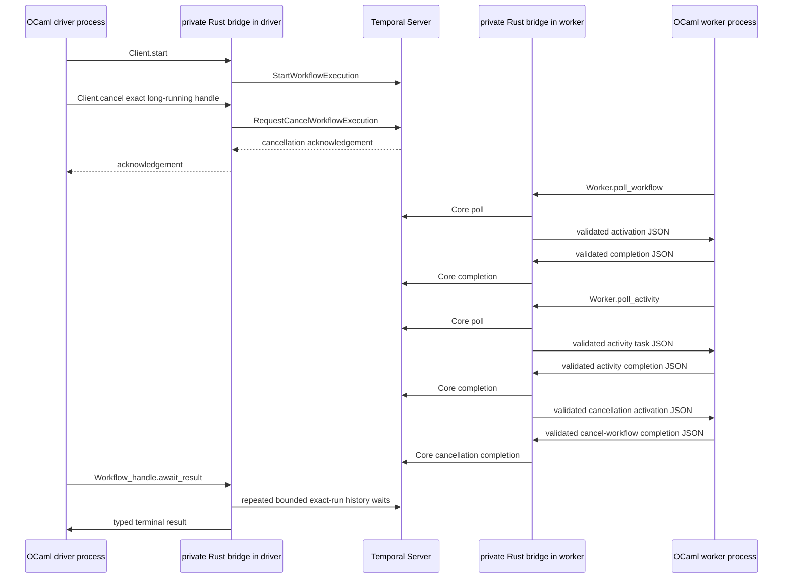

# Two-OCaml-binary Temporal acceptance design

**Status:** The fan-out, timer/activity, parent/child, activity-retry, and
typed non-retryable workflow-failure scenarios were verified in Linux CI run
[`29191260073`](https://github.com/mfow/ocaml-temporal/actions/runs/29191260073)
for merge commit `a4eaccc8`. The retry workflow uses an explicit activity retry
policy: its worker activity fails once, Temporal delivers a second attempt,
and the driver asserts the exact attempt-2 result. The retry-policy constructor
and bilateral JSON/Core conversion remain synthetic evidence; the CI run is
the live evidence for this one server-managed retry delivery. The fifth
top-level workflow also returns a typed non-retryable `Workflow` failure. The
six-run exact-run cancellation path is implemented and covered by local
acceptance checks, but it is not live-verified yet: the attempted [Actions run](https://github.com/mfow/ocaml-temporal/actions/runs/29193818312)
was cancelled before producing a green result. The worker and driver remain
guarded by `TEMPORAL_TWO_BINARY_LIVE=1`; only the dedicated Compose services
set it.

The current implementation starts all six top-level workflows before waiting
for any result, and its local assertion target requires four exact successes,
one typed non-retryable failure, and one exact-run cancellation. Only the five
baseline executions are currently backed by live CI evidence; the cancellation
assertion remains local-only until a green live run verifies it.

`smoke-worker` publishes an atomic readiness marker after public
`Temporal.Worker.create` succeeds. Compose waits for that health check before
`smoke-driver` is run. Each acceptance run starts after `temporal-clean` has
removed the Compose project and its PostgreSQL data volume, and cleanup removes
that volume again on success or failure; no database state is preserved for a
later acceptance run. The driver starts all six top-level workflows before
waiting for any result. The cancellation scenario waits for the
`smoke.cancellation_ready` activity marker after the long-running workflow has
issued its durable-timer and marker commands in one activation, then
acknowledges cancellation for `two-binary-long-running-cancellation` before
the first terminal wait. Four must complete with exact payloads, one must
return a typed non-retryable workflow failure, and the cancelled execution
must return typed `Cancelled` metadata when the driver waits on that same exact
handle. This prevents a TCP check or a process that merely started from being
reported as an SDK acceptance pass.

The public `Temporal.Client` and `Temporal.Worker` now route HTTP(S) calls
through the private Rust/Core supervisor. The deterministic `mock://` backend
remains available for unit tests. The worker's native poll, bounded readiness,
completion, and typed registration loop is covered by focused tests; the
Compose acceptance supplies the first real-server verification layer.

During teardown, the worker's small test-process control Domain translates
Compose's SIGTERM into `Temporal.Worker.shutdown`; the signal handler itself
only sets an atomic flag. The 30-second worker stop grace period gives the
bounded native waits time to leave their poll loop before the container is
removed. This is test-process lifecycle code, not a second worker supervisor.

The fixture implementation is designed to start the two public binaries after
Temporal/PostgreSQL readiness and assert terminal workflow results while the
worker executes registered workflows and a mock activity against the live
server. This revision adds a
parent/child success case: the parent calls `Temporal.Child_workflow.execute`,
the registered child waits on a short durable timer, and the driver asserts the
parent's exact result. It also runs `smoke.activity_retry`: the first
`smoke.retry_once` attempt returns a retryable activity error and the second
returns `SMOKE:ATTEMPT:2`, which the driver compares as an exact terminal
payload. The driver also starts `smoke.non_retryable_failure` and requires its
stable typed error metadata. It starts `smoke.long_running_cancellation`, waits
for its `smoke.cancellation_ready` marker activity (with eager execution
disabled), sends an exact-run cancellation request, and requires the same
handle to return a typed `Cancelled` error. The cancellation implementation and
local assertions are ready, but this six-run path remains without green live CI
evidence because the attempted [Actions run](https://github.com/mfow/ocaml-temporal/actions/runs/29193818312)
was cancelled. Child start failures, activity retry timeouts, replay, and worker
recovery remain separate scenarios. The
intentionally broader follow-up requirements are listed in [Required
assertions and failure evidence](#required-assertions-and-failure-evidence).

## Purpose

The first live acceptance test must prove more than that PostgreSQL and
Temporal Server accept connections. It must prove that two independently
started **OCaml executables**, both linked against the public `temporal-sdk`
library, can use the same Temporal namespace and task queue:

1. the **driver**, a one-shot OCaml test runner, starts more than one workflow,
   checks each expected terminal result, and exits nonzero for a failed
   assertion; and
2. the **worker** receives workflow and activity tasks, runs registered OCaml
   workflow and mock-activity implementations, and reports their completions
   through the private Rust/Core bridge.

The two roles are intentionally asymmetric. `smoke-driver` creates a
client-only SDK instance; it does not register a worker, poll tasks, or execute
workflow/activity implementations. `smoke-worker` is the long-lived Temporal
worker that performs those operations. The driver's assertions are the
acceptance oracle: a successful worker process alone is not a passing test.

The driver is not allowed to call Rust, Temporal's gRPC API, the Temporal CLI,
or a test-only service directly. The worker is not allowed to use test-only
activation injection. Both applications must use the installed public OCaml
library surface. Rust remains a private static-library implementation detail
of each executable.

This is deliberately a worker-SDK acceptance test, not merely a client
smoke test. A green result for the full current acceptance contract would mean
the complete path below was observed:



`R1` and `R2` are linked copies of the same project-owned Rust static library,
not a server or a sidecar. The two processes intentionally have independent
SDK instances and native resource graphs.

## Test topology and file ownership

All assets specific to this acceptance test belong below
`test/integration/temporal/`; the repository root keeps only Makefile entry
points. In particular, the Compose fixture belongs at
`test/integration/temporal/compose.yaml`, together with its Temporal Server
configuration and helper scripts. The eventual OCaml executables and their
Dune definitions should live under that same test subtree, for example:

```text
test/integration/temporal/
├── compose.yaml
├── config/
├── scripts/
├── common/
│   ├── dune
│   └── smoke_definitions.ml
├── worker/
│   ├── dune
│   └── smoke_worker.ml
└── driver/
    ├── dune
    └── smoke_driver.ml
```

The Compose services are `postgresql`, `temporal`, `smoke-worker`, and
`smoke-driver`. `smoke-worker` and `smoke-driver` use the same development
image and repository checkout, but execute different Dune binaries. This
proves that the public library can be linked into more than one OCaml-owned
binary; it does not imply that an application must share a Rust runtime across
processes. Each process uses its own absolute Dune build directory
(`/workspace/_build/smoke-worker` or `/workspace/_build/smoke-driver`). Dune
keeps a build-directory lock for the lifetime of `dune exec`; separate
directories are therefore required while the worker is running, otherwise the
driver's build can wait forever on the worker's lock before its OCaml code
starts.

The worker health check becomes healthy only after `Temporal.Worker.create`
has connected, validated the native worker, and registered its OCaml
definitions. It deliberately publishes readiness before `Worker.run` enters
the long-lived poll loop, so Compose can launch the driver without treating a
bare process or TCP listener as readiness. The final pass/fail signal remains
the driver's exit status after its result assertions; it must not be replaced
by a schema migration, namespace registration, TCP check, or a `temporal
operator cluster health` check.

`make test-temporal-integration` owns the fixture lifecycle: create its
isolated Compose project, run the low-level lifecycle check, wait for the
worker health marker, wait for the driver's terminal exit status, collect the
worker logs on failure, then tear the project down. The explicit alias
`make test-temporal-two-binary` is provided for callers that want the focused
acceptance name. Native Windows and macOS jobs do not run this Linux Compose
acceptance test.

## The two OCaml programs

### Worker executable

The worker is a normal OCaml application. Its configuration names one
namespace and one dedicated smoke task queue. Before calling `run`, it
registers these local definitions with the public SDK:

* `smoke.fan_out`: starts two mock activities before it awaits either one,
  uses `Future.all`, and returns the ordered combined result. The mock
  activity returns a value derived from its input, so the workflow cannot
  produce the asserted result without processing both activity completions.
* `smoke.timer_then_activity`: starts a short durable timer, awaits it, then
  starts and awaits a mock activity. Its result distinguishes this workflow
  from `smoke.fan_out` and proves timer resolution as well as workflow and
  activity task processing.
* `smoke.child_after_timer`: a child workflow that awaits a short durable timer
  and returns a deterministic result from its input. It owns the timer so the
  parent/child success path exercises a timer activation for the child run.
* `smoke.parent_awaits_child`: starts `smoke.child_after_timer` through
  `Temporal.Child_workflow.execute` and awaits its terminal value. The child
  identity is derived only from the parent input, so the command is stable on
  replay.
* `smoke.activity_retry`: schedules `smoke.retry_once` with a two-attempt
  `Temporal.Activity.Retry_policy`. The worker activity deliberately returns a
  retryable error on its first call and includes the successful attempt number
  in its second result, giving the driver a direct assertion that Temporal
  performed the retry.
* `smoke.long_running_cancellation`: waits on a deliberately long durable
  timer. The driver cancels the exact run while that timer is outstanding and
  later asserts the typed `Cancelled` category, `non_retryable=false`, and the
  stable cancellation message.
* `smoke.mock_transform`: the OCaml mock activity implementation used by the
  two activity-oriented workflows. It has no network or wall-clock dependency
  and returns a value wholly determined by its decoded input.
* `smoke.retry_once`: the test-only activity implementation used by
  `smoke.activity_retry`. Its process-local attempt counter is intentionally
  outside workflow code; a fresh worker process and fresh PostgreSQL stack are
  created for each acceptance run.

The fixture implements this shape with the concrete `smoke.fan_out`,
`smoke.timer_then_activity`, `smoke.activity_retry`,
`smoke.child_after_timer`, `smoke.parent_awaits_child`,
`smoke.non_retryable_failure`, `smoke.long_running_cancellation`,
`smoke.mock_transform`, `smoke.retry_once`, and `smoke.cancellation_ready`
definitions, all of which are registered by the long-lived public worker:

```ocaml
let () =
  match
    Temporal.Worker.create
      ~task_queue:"ocaml-temporal-two-binary-smoke"
      ~workflows:
        [ fan_out; timer_then_activity; activity_retry; child_after_timer;
          parent_awaits_child; non_retryable_failure; long_running_cancellation ]
      ~activities:[ mock_transform; retry_once_activity; cancellation_ready_activity ]
      ()
  with
  | Error error -> report_and_exit error
  | Ok worker -> Temporal.Worker.run worker |> report_and_exit
```

The important property is that these are OCaml functions registered by the
worker executable, rather than synthetic protocol fixtures or Rust test
handlers.

The workflow bodies obey normal replay rules: no process environment reads,
filesystem access, wall-clock reads, random values, mutable process-global
state, unordered collection iteration, or network I/O. Only SDK operations
create Temporal commands. The activity may do nondeterministic work in later
tests, but this first mock stays deterministic so result assertions remain
unambiguous.

### Driver executable

The driver is a one-shot OCaml acceptance-test executable. It creates a
client-only SDK instance and does **not** register a worker; the other
executable, `smoke-worker`, owns task polling and workflow/activity execution.
The driver must:

1. connect through `Temporal.Client` to the fixture namespace;
2. start `smoke.fan_out`, `smoke.timer_then_activity`,
   `smoke.activity_retry`, `smoke.parent_awaits_child`, and
   `smoke.non_retryable_failure`, and `smoke.long_running_cancellation` with
   distinct, known workflow IDs before it waits for any of them;
3. retain the six public workflow handles returned by `start`;
4. call `Temporal.Client.cancel` on the exact long-running handle and require
   its positive acknowledgement before waiting for any terminal result;
5. wait for each handle's terminal result through the public client API; and
6. decode and compare the four successful results, require the fifth result to
   be a typed non-retryable workflow failure, require the sixth result to be a
   typed `Cancelled` outcome with expected metadata, then exit zero only if
   every assertion succeeded.

Starting all six executions before the first wait is material. It demonstrates
that a client can hold independent workflow handles while a control request is
issued for one exact run, and that the worker can service separate workflow
executions rather than passing a single serial request through a readiness-only
check. Workflow IDs are fixed and unique within the freshly created fixture
database, and run IDs returned by `start` are retained for exact result and
cancellation operations. Because the acceptance target recreates that database
for every run, it does not depend on a retained volume or on test-run suffixes.
Randomness in the driver is acceptable but randomness in a workflow is not.

The driver returns a nonzero status for connection, start, terminal workflow,
codec, timeout, or assertion failures. A workflow failure is an expected
typed result at the library boundary; it must not be represented by an
uncaught OCaml exception. Its diagnostic output is metadata-only: operation,
workflow ID, run ID when available, error kind, and latency. It must not print
payload bytes or bridge JSON.

## Required private bridge operations

The existing [private JSON control protocol](core-protocol.md) remains the
only OCaml/Rust data boundary. Rust is the only code that reads or writes
Temporal/Core protobuf. The following operation names are the minimal first
live slice; their bodies must be closed schemas and have Rust and OCaml
validators before an operation changes native or workflow state.

| Operation | Direction | Required result | Purpose |
|---|---|---|---|
| `client.connect` | OCaml to Rust | client-ready acknowledgement | Builds the connected Core client in the instance graph using endpoint, namespace, TLS, and identity configuration supplied at instance creation. |
| `client.start_workflow` | OCaml to Rust | exact `{workflow_id, run_id}` | Converts a typed OCaml input payload and start options into `StartWorkflowExecution`. |
| `client.wait_workflow_result` | OCaml to Rust | terminal completed payload, typed terminal failure, continued-as-new successor, or retryable `NOT_READY` | Performs a close-event long poll for that exact execution for at most 100 ms per call; the caller retries an open run without polling a worker task queue. |
| `worker.create` | OCaml to Rust | worker-ready acknowledgement | Creates and validates the Core worker for the configured namespace/task queue. |
| `worker.poll_workflow` | OCaml to Rust | one workflow activation or a terminal shutdown indication | Calls Core's workflow-activation poll and converts the returned protobuf to the existing semantic activation JSON. |
| `worker.complete_workflow` | OCaml to Rust | acknowledgement | Validates the existing semantic completion JSON, converts it to Core protobuf, and completes the activation. |
| `worker.poll_activity` | OCaml to Rust | one semantic activity task or a terminal shutdown indication | Calls Core's activity-task poll and converts task token, identity, headers, input payloads, attempt, and deadlines to JSON. |
| `worker.complete_activity` | OCaml to Rust | acknowledgement | Validates an OCaml activity result/failure/cancellation and completes exactly the supplied task token. |
| `worker.record_activity_heartbeat` | OCaml to Rust | acknowledgement | Validates copied heartbeat details and records progress for exactly the supplied leased activity task without completing or retiring its lease. |
| `worker.initiate_shutdown` | OCaml to Rust | acknowledgement | Stops admission and asks Core to begin graceful worker shutdown. |

The current activation/completion schema defines the workflow-side semantic
conversion for initialization, activity resolution, timer firing, cancellation,
eviction, activity scheduling, timers, and terminal commands. The closed
`activity-task` and `activity-completion` schemas are validated by both
language adapters, and the initial live slice connects them to the native
poll/completion loop. They represent only the information an OCaml activity
runner needs; raw `ActivityTask` protobuf bytes, raw pointers, and Core errors
are forbidden outside Rust. The first acceptance test uses the task token,
activity type, workflow/run identifiers, attempt, input payloads, and
completion variants needed for its mock activity. The heartbeat document and
`worker.record_activity_heartbeat` operation are now implemented with strict
bilateral validation and focused native tests, but the current live fixture
does not yet invoke them. Live heartbeat, timeout, and retry behavior remains
an acceptance follow-up. Local-activity and asynchronous-completion fields
can be added as separate closed changes.

`client.start_workflow` accepts workflow type, workflow ID, task queue, and
typed input payloads. It returns the server-issued run ID. `client.wait_workflow_result`
accepts both workflow ID and that run ID, so a continued-as-new or a later run
with the same workflow ID cannot be confused with the started execution. Its
terminal response is a closed variant for completed result, failed execution,
cancelled execution, terminated execution, timed out execution,
continued-as-new execution (including the successor run ID), or a bridge
transport failure. An exact-run wait does not silently follow
continued-as-new: it returns that typed successor outcome so callers can
explicitly decide whether to await the new run. The public OCaml API keeps the
first six as typed workflow-result outcomes and reserves bridge transport
failure for `Error`.

The worker operations use `request`/terminal `response` or `error` envelopes
with ordinary correlations. A poll response carries an activation/task only
after Rust has copied it into a Rust-owned result buffer and both sides have
validated it. Completion input is copied and validated before Rust mutates
Core. Every output follows the existing validate, normalize, encode, strict
decode, and validate-again rule. Error messages are bounded, typed, and
payload-free.

## Pinned Temporal Core mapping

The Cargo lockfile pins Temporal Core to commit
`95e97686a079dcfe6c42e3254b2f3f5e3d97408f`. This design is tied to that
revision and must be rechecked when the pin changes.

Rust creates its Tokio/Core runtime once for an SDK instance. It connects a
`temporalio_client::Connection`, then constructs the worker with
`temporalio_sdk_core::init_worker`. Worker construction must run in that
runtime's entered Tokio context: the pinned implementation uses Tokio task
creation while it builds worker internals. `Worker::validate()` is awaited once
before any poll, as required by Core.

The relevant pinned Core contracts are:

* [`init_worker`](https://github.com/temporalio/sdk-core/blob/95e97686a079dcfe6c42e3254b2f3f5e3d97408f/crates/sdk-core/src/lib.rs)
  constructs a `Worker` from the Core runtime, worker configuration, and
  connection.
* [`Worker::poll_workflow_activation` and
  `Worker::complete_workflow_activation`](https://github.com/temporalio/sdk-core/blob/95e97686a079dcfe6c42e3254b2f3f5e3d97408f/crates/sdk-core/src/worker/mod.rs)
  are the workflow poll/complete pair. Core requires a response for every
  activation and forbids concurrent workflow polls on one worker; a missing
  completion can permanently stall that run.
* [`Worker::poll_activity_task` and
  `Worker::complete_activity_task`](https://github.com/temporalio/sdk-core/blob/95e97686a079dcfe6c42e3254b2f3f5e3d97408f/crates/sdk-core/src/worker/mod.rs)
  are the corresponding activity pair. Core forbids concurrent activity polls
  on one worker and allows activity completions concurrently.
* [`Worker::initiate_shutdown`, `shutdown`, and
  `finalize_shutdown`](https://github.com/temporalio/sdk-core/blob/95e97686a079dcfe6c42e3254b2f3f5e3d97408f/crates/sdk-core/src/worker/mod.rs)
  require the language SDK to stop admitting work, drain polls until they
  report shutdown, complete outstanding tasks, and then release the worker.
* The client start path uses Rust's pinned Temporal client
  `StartWorkflowExecution` RPC; result waiting uses the corresponding
  history/close-event long-poll path. These protobuf details stay in Rust and
  are represented to OCaml only by the semantic JSON messages above.

The bridge must use the checked-in Core crates, not the upstream callback C
bridge. The upstream C bridge is useful only as behavior reference; this
project deliberately uses synchronous, owned-byte calls so arbitrary Rust
threads never invoke OCaml callbacks.

## Ownership, concurrency, and shutdown

One OCaml supervisor actor owns the whole Rust graph for each process: Tokio
runtime, connection/client, optional worker, native readiness primitive, and
shutdown coordination. The driver owns a graph with no worker; the worker owns
a graph with one worker for this acceptance test. There is no actor per client,
workflow handle, activation, activity task, or Rust handle.

The supervisor serializes graph creation and lifecycle transitions. Exact-run
history waits are close-event long polls with a 100 ms native deadline. A
timeout cancels the request and returns `NOT_READY`, so the owner Domain can
service shutdown or another lifecycle message before a caller or orchestration
loop retries the wait through the OCaml mailbox. Close first rejects new
operations, signals blocked polls, waits for any current bounded call and
outstanding OCaml workflow/activity work to reach a terminal state, then
destroys resources in reverse order:

```text
stop admission
  -> Worker.initiate_shutdown
  -> drain both poll loops and complete accepted work
  -> Worker.finalize_shutdown
  -> client/connection
  -> Core runtime and Tokio runtime
```

This separation preserves the one-owner graph without serializing long-lived
network operations behind a single mailbox. It also prevents a use-after-free:
native destruction cannot begin while a lease holds an `Arc` to the Rust
worker/client. Once shutdown starts, a later operation receives a typed
`Closed`/shutdown result, never a dangling handle.

There is exactly one in-flight `worker.poll_workflow` request and one
in-flight `worker.poll_activity` request per worker, because the pinned Core
contract forbids concurrent polls of either type. Workflow and activity
completion calls may overlap in Rust, but each must carry a one-shot operation
correlation and an exact activation run ID or activity task token. Rust keeps a
bounded outstanding-work ledger:

* add a workflow entry only after a successful poll response is committed;
* remove it only after its one accepted completion reaches a terminal Core
  response;
* reject duplicate, unknown, or post-shutdown completions before Core;
* apply the analogous rule to activity task tokens; and
* turn malformed JSON, conversion failures, and OCaml workflow defects into a
  valid failure completion whenever Core still expects a response.

This ledger is bridge-owned state guarded by one Rust mutex/actor and is not
an OCaml hash table shared across Domains. Its purpose is correctness and
bounded lifetime accounting, not scheduling. The OCaml workflow runtime keeps
its own deterministic execution state per Temporal run and never shares it
between executions.

C stubs release the OCaml runtime lock for a blocking bridge call. They copy
returned Rust bytes into OCaml-managed memory before freeing the Rust result
buffer. Rust threads signal only the native readiness primitive; they never
call an OCaml closure. Consequently a long client result wait or worker poll
cannot block an OCaml workflow effect scheduler or run OCaml code on a Tokio
thread.

## Required assertions and failure evidence

The current driver's successful exit is intended to establish all of the
following locally; a green live run is still required before the six-run
claims become live evidence:

1. each top-level workflow start returned a nonempty run ID that the driver
   retained for its corresponding exact-run wait; the driver starts six
   distinct top-level runs before its first wait;
2. the driver observes the atomically published
   `SMOKE_CANCELLATION_READY_FILE` marker containing the current run token,
   proving the timer and marker commands were accepted before cancellation;
3. the cancellation request names the long-running workflow's exact retained
   workflow ID and run ID, and Temporal acknowledges it before the driver waits;
4. all six terminal waits matched the exact workflow ID and run ID returned by
   their own starts;
5. `smoke.fan_out` returned the ordered result requiring both mock activity
   completions;
6. `smoke.timer_then_activity` returned its expected result after a durable
   timer and its mock activity completion;
7. `smoke.activity_retry` returned `SMOKE:ATTEMPT:2` only after its first
   activity attempt failed and Temporal scheduled the second attempt;
8. `smoke.parent_awaits_child` returned `SMOKE:CHILD` only after its child
   completed its own durable timer; and
9. the four success responses were not workflow failures, cancellations,
   timeouts, terminations, continued-as-new outcomes, codec failures, or
   bridge failures; and
10. `smoke.non_retryable_failure` returned a `Workflow` error with
   `non_retryable=true` and the stable intentional-failure message prefix; and
11. `smoke.long_running_cancellation` returned a `Cancelled` error with
   `non_retryable=false` and the stable message `workflow execution was
    cancelled`.

The driver logs no-payload phase records for starts, exact-run cancellation,
exact-run waits, terminal classes, and operation latency. The Makefile requires
the driver's `client_shutdown status=ok` marker, and after that stops the
worker and requires `two-binary worker stopped cleanly`. The harness captures
these records only for failure diagnosis; result assertions, not log text, are
the workflow success oracle. Per-activation/task identifiers and completion
latency are a future observability enhancement and must remain payload-free if
added.

The first live test is intentionally small. With this success path verified,
extend the same two-binary topology rather than adding a separate pseudo-worker
test:

* live activity heartbeat, timeout, and retry behavior, plus activity-level
  non-retryable classification;
* multiple concurrent activities with `Future.all`, `race`, and cancellation;
* child workflow start failure, cancellation, retry policy, and non-success
  terminal handling through the worker;
* worker restart, replay, sticky-cache eviction, and continued execution; and
* cancellation of child/activity work and graceful shutdown while multiple
  executions are outstanding.

Child-start commands and both child-resolution jobs have a closed bilateral
schema, Core conversion, pure-OCaml lifecycle tests, and this one real-server
parent/child success assertion. The activity retry policy has the same
separation: bilateral policy validation is synthetic, while CI run
[`29191260073`](https://github.com/mfow/ocaml-temporal/actions/runs/29191260073)
makes its attempt-2 result live evidence for one server-managed retry. Neither
assertion claims coverage of child failure/cancellation, retry timeouts, replay,
or recovery behavior.

## Completion criteria for this design

The full current acceptance contract will be verified in Linux CI only when all
of the following are true. The historical live result verifies the five
baseline executions; the six-run cancellation assertion remains local-only
until a run satisfies this complete contract:

* the nested Compose fixture starts real PostgreSQL and Temporal Server;
* it builds two separate OCaml executables that both link `temporal-sdk`;
* the worker's live Core poll/complete loops execute the registered OCaml
  workflow and mock activity code;
* the driver starts all six top-level workflows through `temporal-sdk`, sends
  an exact-run cancellation request, waits for their results through
  `temporal-sdk`, and performs the listed success, typed-failure, and
  cancellation assertions;
* the fixture exits nonzero for a failed driver assertion, a workflow failure,
  a worker crash, or a cleanup timeout; and
* the focused test plus the normal Makefile verification and dependency
  quality gates passed for the change that introduced the gate.

Passing infrastructure readiness alone remains insufficient evidence. The
success criteria above do not claim live coverage for the follow-up scenarios
listed earlier in this document.
