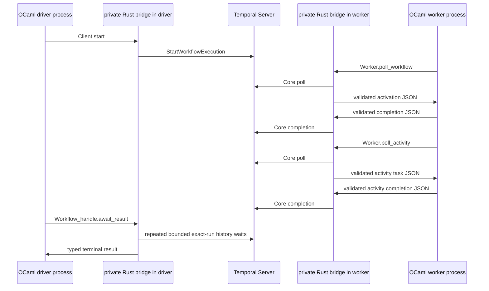

# Two-OCaml-binary Temporal acceptance design

**Status:** The source-level driver and worker scaffold now exists under
`test/integration/temporal/{common,driver,worker}`. It proves that both
executables can be compiled against the same public `temporal-sdk` package,
but it is not a live test yet. The binaries refuse to run unless
`TEMPORAL_TWO_BINARY_LIVE=1` is set, and no Compose service enables that flag.

The public `Temporal.Client` now routes HTTP(S) start and exact-run wait calls
through the private Rust/Core supervisor. The deterministic `mock://` backend
remains available for unit tests. The worker still needs its native poll,
readiness, and completion loop wired into the public registration/dispatch
surface; running the scaffold against `temporal:7233` before those worker seams
exist would test a partial path and could be mistaken for a green SDK
acceptance test.

The remaining blockers are concrete rather than environmental:

1. connect the native workflow/activity poll and completion operations to the
   deterministic execution registry and public worker loop; and
2. connect the existing activity-task semantic conversion, add worker
   readiness/health signalling, and add Compose services that run these two
   binaries only after those operations are wired.

Until those seams are complete, CI should continue running the existing
Core-client/worker lifecycle smoke and compile the scaffold with the ordinary
OCaml build. It must not promote the scaffold to a live acceptance target.

## Purpose

The first live acceptance test must prove more than that PostgreSQL and
Temporal Server accept connections. It must prove that two independently
started **OCaml executables**, both linked against the public `temporal-sdk`
library, can use the same Temporal namespace and task queue:

1. the **driver** starts more than one workflow and waits for each terminal
   result; and
2. the **worker** receives workflow and activity tasks, runs registered OCaml
   workflow and mock-activity implementations, and reports their completions
   through the private Rust/Core bridge.

The driver is not allowed to call Rust, Temporal's gRPC API, the Temporal CLI,
or a test-only service directly. The worker is not allowed to use test-only
activation injection. Both applications must use the installed public OCaml
library surface. Rust remains a private static-library implementation detail
of each executable.

This is deliberately a worker-SDK acceptance test, not merely a client
smoke test. A green result means the complete path below was observed:



`R1` and `R2` are linked copies of the same project-owned Rust static library,
not a server or a sidecar. The two processes intentionally have independent
SDK instances and native resource graphs.

## Test topology and file ownership

All assets specific to this acceptance test belong below
`test/integration/temporal/`; the repository root keeps only Makefile entry
points. In particular, the Compose fixture belongs at
`test/integration/temporal/compose.yaml`, together with its Temporal Server
configuration and helper scripts. The eventual OCaml executables and their
Dune definitions should live under that same test subtree, for example:

```text
test/integration/temporal/
├── compose.yaml
├── config/
├── scripts/
├── common/
│   ├── dune
│   └── smoke_definitions.ml
├── worker/
│   ├── dune
│   └── smoke_worker.ml
└── driver/
    ├── dune
    └── smoke_driver.ml
```

The Compose services are `postgres`, `temporal`, `smoke-worker`, and
`smoke-driver`. `smoke-worker` and `smoke-driver` use the same development
image and repository checkout, but execute different Dune binaries. This
proves that the public library can be linked into more than one OCaml-owned
binary; it does not imply that an application must share a Rust runtime across
processes.

The worker health check may become healthy only after it has connected,
validated its worker, registered its OCaml definitions, and started both
worker poll loops. It is not sufficient for the worker process merely to
exist. The driver may start after that health check, but the final pass/fail
signal is the driver's exit status after its result assertions. It must not be
replaced by a schema migration, namespace registration, TCP check, or a
`temporal operator cluster health` check.

`make temporal-test` (or the focused successor to that target) owns the
fixture lifecycle: create its isolated Compose project, wait for the driver's
terminal exit status, collect the worker and driver logs on failure, then tear
the project down. Native Windows and macOS jobs do not run this Linux Compose
acceptance test.

## The two OCaml programs

### Worker executable

The worker is a normal OCaml application. Its configuration names one
namespace and one dedicated smoke task queue. Before calling `run`, it
registers these local definitions with the public SDK:

* `smoke.fan_out`: starts two mock activities before it awaits either one,
  uses `Future.all`, and returns the ordered combined result. The mock
  activity returns a value derived from its input, so the workflow cannot
  produce the asserted result without processing both activity completions.
* `smoke.timer_then_activity`: starts a short durable timer, awaits it, then
  starts and awaits a mock activity. Its result distinguishes this workflow
  from `smoke.fan_out` and proves timer resolution as well as workflow and
  activity task processing.
* `smoke.mock_transform`: the OCaml mock activity implementation used by both
  workflows. It has no network or wall-clock dependency and returns a value
  wholly determined by its decoded input.

The exact public registration names may evolve, but the intended shape is
ordinary OCaml definitions followed by a long-running worker call:

```ocaml
let () =
  match
    Temporal.Worker.create
      ~task_queue:"ocaml-temporal-two-binary-smoke"
      ~workflows:[ fan_out; timer_then_activity ]
      ~activities:[ mock_transform ]
      ()
  with
  | Error error -> report_and_exit error
  | Ok worker -> Temporal.Worker.run worker |> report_and_exit
```

This is illustrative API design, not a promise that these exact identifiers
already exist. The important property is that `fan_out`,
`timer_then_activity`, and `mock_transform` are OCaml functions registered by
the worker executable, rather than synthetic protocol fixtures or Rust test
handlers.

The workflow bodies obey normal replay rules: no process environment reads,
filesystem access, wall-clock reads, random values, mutable process-global
state, unordered collection iteration, or network I/O. Only SDK operations
create Temporal commands. The activity may do nondeterministic work in later
tests, but this first mock stays deterministic so result assertions remain
unambiguous.

### Driver executable

The driver is also a normal OCaml application, but it creates a client-only
SDK instance and does **not** register a worker. It must:

1. connect through `Temporal.Client` to the fixture namespace;
2. start `smoke.fan_out` and `smoke.timer_then_activity` with distinct,
   known workflow IDs before it waits for either one;
3. retain the two public workflow handles returned by `start`;
4. wait for each handle's terminal result through the public client API; and
5. decode and compare both results with their expected values, then exit zero
   only if every assertion succeeded.

Starting both executions before the first wait is material. It demonstrates
that a client can hold independent workflow handles and that the worker can
service separate workflow executions, rather than passing a single serial
request through a readiness-only check. Workflow IDs are fixed, unique within
the freshly created fixture database, and run IDs returned by `start` are
retained for exact result waiting. If the fixture is ever reused instead of
recreated, the Make target must provide a unique test-run suffix outside
workflow code; randomness in the driver is acceptable but randomness in a
workflow is not.

The driver returns a nonzero status for connection, start, terminal workflow,
codec, timeout, or assertion failures. A workflow failure is an expected
typed result at the library boundary; it must not be represented by an
uncaught OCaml exception. Its diagnostic output is metadata-only: operation,
workflow ID, run ID when available, error kind, and latency. It must not print
payload bytes or bridge JSON.

## Required private bridge operations

The existing [private JSON control protocol](core-protocol.md) remains the
only OCaml/Rust data boundary. Rust is the only code that reads or writes
Temporal/Core protobuf. The following operation names are the minimal first
live slice; their bodies must be closed schemas and have Rust and OCaml
validators before an operation changes native or workflow state.

| Operation | Direction | Required result | Purpose |
|---|---|---|---|
| `client.connect` | OCaml to Rust | client-ready acknowledgement | Builds the connected Core client in the instance graph using endpoint, namespace, TLS, and identity configuration supplied at instance creation. |
| `client.start_workflow` | OCaml to Rust | exact `{workflow_id, run_id}` | Converts a typed OCaml input payload and start options into `StartWorkflowExecution`. |
| `client.wait_workflow_result` | OCaml to Rust | terminal completed payload, typed terminal failure, continued-as-new successor, or retryable `NOT_READY` | Performs a close-event long poll for that exact execution for at most 100 ms per call; the caller retries an open run without polling a worker task queue. |
| `worker.create` | OCaml to Rust | worker-ready acknowledgement | Creates and validates the Core worker for the configured namespace/task queue. |
| `worker.poll_workflow` | OCaml to Rust | one workflow activation or a terminal shutdown indication | Calls Core's workflow-activation poll and converts the returned protobuf to the existing semantic activation JSON. |
| `worker.complete_workflow` | OCaml to Rust | acknowledgement | Validates the existing semantic completion JSON, converts it to Core protobuf, and completes the activation. |
| `worker.poll_activity` | OCaml to Rust | one semantic activity task or a terminal shutdown indication | Calls Core's activity-task poll and converts task token, identity, headers, input payloads, attempt, and deadlines to JSON. |
| `worker.complete_activity` | OCaml to Rust | acknowledgement | Validates an OCaml activity result/failure/cancellation and completes exactly the supplied task token. |
| `worker.initiate_shutdown` | OCaml to Rust | acknowledgement | Stops admission and asks Core to begin graceful worker shutdown. |

The current activation/completion schema already defines the workflow-side
semantic conversion for initialization, activity resolution, timer firing,
cancellation, eviction, activity scheduling, timers, and terminal commands.
The closed `activity-task` and `activity-completion` schemas already exist and
are validated by both language adapters. The remaining live-slice work is to
connect those codecs to the native poll/completion loop. They represent only
the information an OCaml activity runner needs; raw `ActivityTask` protobuf
bytes, raw pointers, and Core errors are forbidden outside Rust. The first
acceptance test uses their existing task token, activity type, workflow/run
identifiers, attempt, input payloads, and completion variants. Future
heartbeat, local-activity, and asynchronous-completion fields can be added as
separate closed changes.

`client.start_workflow` accepts workflow type, workflow ID, task queue, and
typed input payloads. It returns the server-issued run ID. `client.wait_workflow_result`
accepts both workflow ID and that run ID, so a continued-as-new or a later run
with the same workflow ID cannot be confused with the started execution. Its
terminal response is a closed variant for completed result, failed execution,
cancelled execution, terminated execution, timed out execution,
continued-as-new execution (including the successor run ID), or a bridge
transport failure. An exact-run wait does not silently follow
continued-as-new: it returns that typed successor outcome so callers can
explicitly decide whether to await the new run. The public OCaml API keeps the
first six as typed workflow-result outcomes and reserves bridge transport
failure for `Error`.

The worker operations use `request`/terminal `response` or `error` envelopes
with ordinary correlations. A poll response carries an activation/task only
after Rust has copied it into a Rust-owned result buffer and both sides have
validated it. Completion input is copied and validated before Rust mutates
Core. Every output follows the existing validate, normalize, encode, strict
decode, and validate-again rule. Error messages are bounded, typed, and
payload-free.

## Pinned Temporal Core mapping

The Cargo lockfile pins Temporal Core to commit
`95e97686a079dcfe6c42e3254b2f3f5e3d97408f`. This design is tied to that
revision and must be rechecked when the pin changes.

Rust creates its Tokio/Core runtime once for an SDK instance. It connects a
`temporalio_client::Connection`, then constructs the worker with
`temporalio_sdk_core::init_worker`. Worker construction must run in that
runtime's entered Tokio context: the pinned implementation uses Tokio task
creation while it builds worker internals. `Worker::validate()` is awaited once
before any poll, as required by Core.

The relevant pinned Core contracts are:

* [`init_worker`](https://github.com/temporalio/sdk-core/blob/95e97686a079dcfe6c42e3254b2f3f5e3d97408f/crates/sdk-core/src/lib.rs)
  constructs a `Worker` from the Core runtime, worker configuration, and
  connection.
* [`Worker::poll_workflow_activation` and
  `Worker::complete_workflow_activation`](https://github.com/temporalio/sdk-core/blob/95e97686a079dcfe6c42e3254b2f3f5e3d97408f/crates/sdk-core/src/worker/mod.rs)
  are the workflow poll/complete pair. Core requires a response for every
  activation and forbids concurrent workflow polls on one worker; a missing
  completion can permanently stall that run.
* [`Worker::poll_activity_task` and
  `Worker::complete_activity_task`](https://github.com/temporalio/sdk-core/blob/95e97686a079dcfe6c42e3254b2f3f5e3d97408f/crates/sdk-core/src/worker/mod.rs)
  are the corresponding activity pair. Core forbids concurrent activity polls
  on one worker and allows activity completions concurrently.
* [`Worker::initiate_shutdown`, `shutdown`, and
  `finalize_shutdown`](https://github.com/temporalio/sdk-core/blob/95e97686a079dcfe6c42e3254b2f3f5e3d97408f/crates/sdk-core/src/worker/mod.rs)
  require the language SDK to stop admitting work, drain polls until they
  report shutdown, complete outstanding tasks, and then release the worker.
* The client start path uses Rust's pinned Temporal client
  `StartWorkflowExecution` RPC; result waiting uses the corresponding
  history/close-event long-poll path. These protobuf details stay in Rust and
  are represented to OCaml only by the semantic JSON messages above.

The bridge must use the checked-in Core crates, not the upstream callback C
bridge. The upstream C bridge is useful only as behavior reference; this
project deliberately uses synchronous, owned-byte calls so arbitrary Rust
threads never invoke OCaml callbacks.

## Ownership, concurrency, and shutdown

One OCaml supervisor actor owns the whole Rust graph for each process: Tokio
runtime, connection/client, optional worker, native readiness primitive, and
shutdown coordination. The driver owns a graph with no worker; the worker owns
a graph with one worker for this acceptance test. There is no actor per client,
workflow handle, activation, activity task, or Rust handle.

The supervisor serializes graph creation and lifecycle transitions. Exact-run
history waits are close-event long polls with a 100 ms native deadline. A
timeout cancels the request and returns `NOT_READY`, so the owner Domain can
service shutdown or another lifecycle message before a caller or orchestration
loop retries the wait through the OCaml mailbox. Close first rejects new
operations, signals blocked polls, waits for any current bounded call and
outstanding OCaml workflow/activity work to reach a terminal state, then
destroys resources in reverse order:

```text
stop admission
  -> Worker.initiate_shutdown
  -> drain both poll loops and complete accepted work
  -> Worker.finalize_shutdown
  -> client/connection
  -> Core runtime and Tokio runtime
```

This separation preserves the one-owner graph without serializing long-lived
network operations behind a single mailbox. It also prevents a use-after-free:
native destruction cannot begin while a lease holds an `Arc` to the Rust
worker/client. Once shutdown starts, a later operation receives a typed
`Closed`/shutdown result, never a dangling handle.

There is exactly one in-flight `worker.poll_workflow` request and one
in-flight `worker.poll_activity` request per worker, because the pinned Core
contract forbids concurrent polls of either type. Workflow and activity
completion calls may overlap in Rust, but each must carry a one-shot operation
correlation and an exact activation run ID or activity task token. Rust keeps a
bounded outstanding-work ledger:

* add a workflow entry only after a successful poll response is committed;
* remove it only after its one accepted completion reaches a terminal Core
  response;
* reject duplicate, unknown, or post-shutdown completions before Core;
* apply the analogous rule to activity task tokens; and
* turn malformed JSON, conversion failures, and OCaml workflow defects into a
  valid failure completion whenever Core still expects a response.

This ledger is bridge-owned state guarded by one Rust mutex/actor and is not
an OCaml hash table shared across Domains. Its purpose is correctness and
bounded lifetime accounting, not scheduling. The OCaml workflow runtime keeps
its own deterministic execution state per Temporal run and never shares it
between executions.

C stubs release the OCaml runtime lock for a blocking bridge call. They copy
returned Rust bytes into OCaml-managed memory before freeing the Rust result
buffer. Rust threads signal only the native readiness primitive; they never
call an OCaml closure. Consequently a long client result wait or worker poll
cannot block an OCaml workflow effect scheduler or run OCaml code on a Tokio
thread.

## Required assertions and failure evidence

The driver's successful exit must establish all of the following:

1. both workflow starts returned distinct, nonempty run IDs;
2. both terminal waits matched the exact workflow ID and run ID returned by
   their own starts;
3. `smoke.fan_out` returned the ordered result requiring both mock activity
   completions;
4. `smoke.timer_then_activity` returned its expected result after a durable
   timer and its mock activity completion; and
5. neither terminal response was a workflow failure, cancellation, timeout,
   termination, continued-as-new outcome, codec failure, nor bridge failure.

The worker must additionally log (without payloads) one lifecycle-ready event,
each accepted workflow activation and activity task with stable identifiers,
each completion outcome and latency, and shutdown/drain status. The test
harness captures these logs only for failure diagnosis. Result assertions, not
log text, are the success oracle.

The first live test is intentionally small. Once it passes, extend the same
two-binary topology rather than adding a separate pseudo-worker test:

* activity failure/retry and timeout;
* multiple concurrent activities with `Future.all`, `race`, and cancellation;
* child workflow start/completion after its command schema is implemented;
* worker restart, replay, sticky-cache eviction, and continued execution; and
* cancellation and graceful shutdown while work is outstanding.

Child workflows are not claimed by the first slice because the current
semantic completion protocol does not yet translate child-workflow commands.
Adding them requires a closed bilateral schema, deterministic runtime support,
and live tests before they join this acceptance suite.

## Completion criteria for this design

This design is implemented only when all of the following are true in Linux
CI:

* the nested Compose fixture starts real PostgreSQL and Temporal Server;
* it builds two separate OCaml executables that both link `temporal-sdk`;
* the worker's live Core poll/complete loops execute the registered OCaml
  workflow and mock activity code;
* the driver starts both workflows through `temporal-sdk`, waits for both
  results through `temporal-sdk`, and performs the listed assertions;
* the fixture exits nonzero for a failed driver assertion, a workflow failure,
  a worker crash, or a cleanup timeout; and
* the focused test plus the normal Makefile verification and dependency
  quality gates pass.

Passing infrastructure readiness alone is explicitly insufficient evidence.
